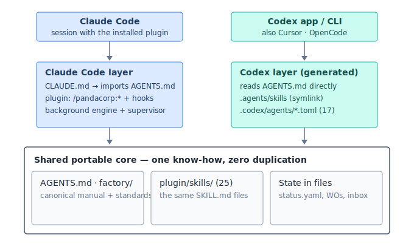

# Proposal 25 — Multi-runtime portability: operate the factory from any coding agent (2026-07-04)

**Status:** IMPLEMENTED & VALIDATED 2026-07-04 — verified by two independent Codex sessions (round 1: 2 blockers found — content loss in the CLAUDE.md→AGENTS.md inversion, unrelated `mission-control/.pandacorp/` working-tree deletion — both fixed same day; PORT-5 gained an executable playbook; V2 findings filed as BL-0030..0032; round 2: GREEN on all three re-checks). Committed after the owner's cross-runtime validation gate passed.

> **Operational supersession (2026-07-11):** this proposal remains dated design/history. Its D6 claims that file state plus the legacy `running`/heartbeat guard already permit cross-runtime build writes, mutual exclusion and resume are **not current operating permission**. The current contract is `factory/standards/agent-portability.md` PORT-5: strict runtime-local execution; Codex/non-Claude remain read/review-only while the installed R10 switch, current-head live recheck and R11 several-hours overnight canary are pending; runtime changes only as cold continuation after a clean safe-point stop and two-phase ownership release. R2/R3/R6, offline R7/R8/R11 and the fixture R10 switch are green, but those lower evidence levels do not grant build writes. Do not execute this proposal's old attended-write playbook.
**Scope:** Make the Pandacorp factory (and, lighter, its product projects) operable from coding agents other than Claude Code — **OpenAI Codex (app + CLI) first**, Cursor and OpenCode next — via a portable core + thin per-runtime adapters, without forking the know-how or degrading the Claude Code experience.
**Method:** exhaustive repo inventory (coupling census, 8 HARD blockers ranked) + primary-source web research (official Codex/Cursor/OpenCode docs, the AGENTS.md and Agent Skills open standards, community experience reports of cross-tool ports).
**Owner intent:** dual-channel operation — talk to the factory from Claude Code *and* Codex, cross-checking each other's work ("que Codex pruebe lo que ha hecho Claude Code y viceversa"). The Codex **desktop app** is the priority surface; it shares the exact same config surface as the CLI (AGENTS.md, `~/.codex/config.toml`, `.agents/skills`, MCP), so one adapter serves both.

---

## Part 1 — What the research established (July 2026)

### 1.1 The standards landscape converged — mostly in our favor

- **AGENTS.md is the cross-tool instructions standard.** Donated by OpenAI to the Agentic AI Foundation (Linux Foundation, Dec 2025); canonical spec at agents.md. Read natively by Codex (walks git root → cwd, concatenating), Cursor (editor + CLI), OpenCode, Amp, Jules, Gemini CLI and ~20 more. **Claude Code does NOT read it natively** (issue #6235, ~5.2k reactions, open since Aug 2025) — but officially supports importing it from CLAUDE.md via `@AGENTS.md` (the exact pattern our product projects already use).
- **Agent Skills (SKILL.md) is an open standard** (agentskills.io, Anthropic-published Dec 2025, AAIF-stewarded). Codex, Cursor, OpenCode, Gemini CLI, Copilot et al. consume `SKILL.md` natively. Portable core = `name` + `description` frontmatter; **unknown fields are ignored** (so our Claude-only fields like `user-invocable` are harmless). Codex discovers skills at `$REPO_ROOT/.agents/skills/` (plus `~/.agents/skills/`); OpenCode reads `.agents/skills/`, `.claude/skills/` AND `.opencode/skills/`; Cursor is migrating its commands to skills.
- **Codex now has a plugin system compatible with ours by construction** (developers.openai.com/codex/plugins/build): a plugin = `.codex-plugin/plugin.json` manifest + `skills/` + `hooks/hooks.json` + `.mcp.json` at plugin root — structurally our `plugin/` layout. It reads `$REPO_ROOT/.claude-plugin/marketplace.json` as a **legacy-compatible marketplace** and exports `CLAUDE_PLUGIN_ROOT`/`CLAUDE_PLUGIN_DATA` env aliases in plugin hooks.
- **Codex has hooks (2026)** — `SessionStart`, `PreToolUse`, `PostToolUse`, `Stop`, `UserPromptSubmit` etc., via `hooks.json` / `[hooks]` TOML — plus the older `notify` (agent-turn-complete only, user-level config).
- **Codex has subagents (2026)** — TOML defs in `.codex/agents/` or `~/.codex/agents/` (`name`, `description`, `developer_instructions`, optional `model`, `model_reasoning_effort`, `sandbox_mode`), parallel up to `agents.max_threads` (default 6), depth 1, **explicit-request-only**. Parity is shallow: skill-embedded "spawn a subagent" instructions are known to be silently ignored (openai/codex#23496).
- **Codex model surface:** `gpt-5.5` (default/complex), `gpt-5.4` (standard), `gpt-5.4-mini` (cheap/mechanical/subagents), `model_reasoning_effort: minimal…xhigh`; per-invocation `--model`, named profiles (`codex --profile`). No mid-pipeline auto-routing; `codex exec` is single-model per invocation; **subagents cannot receive a model at spawn time** — the model is baked into each agent's TOML, so per-tier delegation needs pre-generated tier agents.
- **Codex instruction-file mechanics that constrain us:** combined AGENTS.md budget defaults to **32 KiB** (`project_doc_max_bytes`); **Claude's `@import` syntax is NOT expanded** (dead text — AGENTS.md must use prose pointers, "read X", not imports); Codex custom prompts (`~/.codex/prompts`) are **deprecated in favor of skills**; skills have **no `$ARGUMENTS` templating** — arguments arrive as free text in the owner's message. Symlinked skill folders are officially supported.
- **No local background execution in Codex.** `codex resume` reloads transcripts; genuinely unattended runs exist only in Codex **Cloud**. Local overnight builds remain a Claude Code capability.

### 1.2 What the community learned porting (the traps we must design around)

1. **Tool-name leakage breaks ports.** Skills whose prose references Claude-only tools (`Task`, `Workflow`, `Monitor`, `TodoWrite`) fail or derail on Codex (blog.fsck.com Superpowers port). → We need an explicit **tool translation table** injected via AGENTS.md, not per-skill rewrites.
2. **Instructions-file duplication drifts.** Teams that copied CLAUDE.md↔AGENTS.md diverged within weeks; the surviving patterns are **symlink** or **import** (one canonical file). → We invert to AGENTS.md-canonical, exactly like our own product overlay already does.
3. **Don't rely on cross-runtime subagent orchestration.** Even where subagents exist, auto-delegation semantics differ; degrade to sequential in-session execution unless the owner explicitly asks for fan-out.

### 1.3 Repo coupling census (inventory, ranked HARD blockers)

1. `pandacorp-build.js` — the build engine is Claude Code **Dynamic Workflows** (injected `agent()/phase()/budget`, `Workflow({...})`, `TaskStop`). No equivalent anywhere. 
2. `plugin/agents/*.md` (14) — Claude-native frontmatter (`tools:`, `model:`, `effort:`, `disallowedTools:`).
3. The 25 skills' *invocation surface* (`/pandacorp:*` slash namespace, `Skill` tool, `user-invocable`).
4. The supervisor stack (`Monitor`, `ScheduleWakeup`, `PushNotification`, `EnterWorktree`/`ExitWorktree`).
5. `hooks.json` lifecycle wiring + `${CLAUDE_PLUGIN_ROOT}` (safety gate, Stop verify-gate, telemetry).
6. Literal `claude plugin install/update/validate` commands in the process docs.
7. Mission Control's `~/.claude/` reads (installed_plugins.json drift banner, dashboard-events.ndjson, transcript mining).
8. `DesignSync` (has a documented fallback already).

**The saving grace:** all durable state is **files, not sessions** — work-order frontmatter (`implementation_status`), `.pandacorp/status.yaml`, the change queue, the decision inbox. Any agent that can read/write files can operate the factory's state machine. The know-how (`factory/`) is plain markdown. Only the *execution vehicle* is Claude-bound.

---

## Part 2 — Design

**Principle: one portable core (documents + file-state + skills), thin per-runtime adapters (discovery + translation + degradation). Never duplicate know-how; generate or link.**

### D1 — Invert the factory root to AGENTS.md-canonical (mirror the product-overlay pattern)

- **`AGENTS.md` (new, factory root)** becomes the canonical, tool-agnostic operating manual: what the repo is, the planes (DR-033/DR-103), language rules (DR-009 — including *"the interaction with the owner is always in Spanish"*), the decision-log discipline, how the factory is operated phase by phase, the **runtime capability matrix + tool translation table** (D5), and the **skill invocation protocol for non-Claude runtimes** (D3).
- **`CLAUDE.md` (root) shrinks** to: `@AGENTS.md` import + Claude-Code-specific sections only (plugin maintenance/`claude plugin *`, Dynamic Workflows/build-engine notes, hook behavior, `/pandacorp:*` slash surface). No content is lost; it moves or stays by one test: *would a non-Claude agent need it or trip on it?*
- Product projects already follow this pattern (AGENTS.md.tpl canonical, CLAUDE.md.tpl thin) — the factory root simply catches up. Windows caveat (symlinks need admin) is moot: we use the import, not a symlink, on the Claude side.

### D2 — Expose the 25 skills via the open standard

- Add `name: <slug>` to every `SKILL.md` frontmatter (spec-required; Claude Code tolerates it — validate with `claude plugin validate`).
- Create **`.agents/skills` → `plugin/skills`** (relative symlink, committed). Codex (app + CLI) and OpenCode then discover all 25 skills when the repo is opened, zero install. Cursor reads them via its skills support.
- Internal skills (`user-invocable: false`) become visible in other runtimes (they ignore that field). Acceptable: their descriptions already say "internal engine"; AGENTS.md §skills tells non-Claude agents which are internal.
- Add **`plugin/.codex-plugin/plugin.json`** — the Codex plugin manifest (name/version/description mirroring `.claude-plugin/plugin.json`, pointing at `./skills/` and `./hooks/hooks.json`). This makes the plugin *installable* in Codex via the repo's existing `.claude-plugin/marketplace.json` (legacy-compatible path) for use from OTHER directories — optional, the symlink already covers in-repo use. Keep both manifests version-synced (a line in the plugin-maintenance ritual).

### D3 — Skill invocation protocol for non-Claude runtimes (in AGENTS.md)

When the owner asks for a phase (`/pandacorp:x`, "ejecuta la fase x", `$x`): read `plugin/skills/<x>/SKILL.md` (or the discovered skill) and follow it, applying:
1. The **tool translation table** (D5) for any Claude-native tool the text references.
2. The **degradation rules** (D6) where no equivalent exists.
3. All human gates, language rules and documentation discipline apply identically — they are runtime-independent.

### D4 — Generate Codex subagents from the canonical agent defs

- New generator `plugin/scripts/generate-codex-agents.mjs`: reads the 14 `plugin/agents/*.md` (frontmatter + body) and emits **`.codex/agents/<name>.toml`** (committed): `name`, `description`, `developer_instructions` (= the agent's body), `model` + `model_reasoning_effort` mapped per the tier table (D5). `plugin/agents/` stays canonical; regenerating is part of the plugin-maintenance ritual when an agent changes.
- Additionally emit **three generic tier workers** (`tier-mech`, `tier-standard`, `tier-judge`) — since Codex bakes the model into the agent TOML (no per-spawn override), these are the delegation vehicle for ad-hoc fan-out at the right cost, mirroring CONV-12 without naming Anthropic models.
- `tools:`/`disallowedTools:` allow-lists don't map → encode the restriction as prose in `developer_instructions` (e.g. the reviewer's "does not edit production code"), which is how Codex scopes behavior anyway (plus `sandbox_mode` where read-only fits: researcher, librarian read-mostly, security-auditor).

### D5 — One model-tier vocabulary, per-runtime mapping (generalizes CONV-12/DR-111)

New standard **`factory/standards/agent-portability.md`** defines runtime-neutral tiers and their mapping:

| Tier | Meaning | Claude Code | Codex | 
|---|---|---|---|
| MECH | mechanical, zero judgment | haiku | gpt-5.4-mini (effort minimal/low) |
| STANDARD | real work, default floor | sonnet | gpt-5.5 (effort medium) |
| JUDGE | genuine judgment / adversarial | opus | gpt-5.5 (effort high/xhigh) |
| — | never auto | Fable | (n/a — most expensive tier only on owner request) |

Plus the **tool translation table** (Claude tool → Codex/other equivalent → fallback): `Agent`/`Task` → Codex subagent (explicit, tier TOMLs) → do it inline sequentially; `Workflow` → **no equivalent** → attended build loop (D6); `Monitor`/`ScheduleWakeup` → none → attended run; `PushNotification` → `notify`/hooks → tell the owner in-chat; `AskUserQuestion` → ask in chat; `EnterWorktree` → `git worktree` by hand; `WebSearch/WebFetch` → Codex web search; `DesignSync` → documented HTML-mockup fallback (DR-058 Plan B); `$ARGUMENTS` in a skill body → the free text of the owner's request. CONV-12/DR-111 get a pointer to this table (their haiku/sonnet/opus wording becomes the Claude column of the neutral tiers).

### D6 — Honest degradation of the build engine (the one thing that does NOT port)

`pandacorp-build.js`, the supervisor and the overnight contract stay **Claude-Code-only** (Dynamic Workflows, Monitor, background resumability have no Codex analogue; Codex subagent parity is too shallow to trust for orchestration — §1.2.3). Under any other runtime, `implement` degrades to the **attended build loop**, specified in the new standard:
- Same state machine (Build Plan order, `implementation_status` frontmatter, `PLANNED → IN_PROGRESS → IN_REVIEW → VERIFIED`), same per-FRD gate (fresh reviewer pass + `verify.sh`), same per-WO commits, same safe-point rules (change-queue drain, `decisions.md`) — executed **sequentially, in-session, owner present**.
- Anything already `VERIFIED` is never rebuilt — which is exactly what makes **cross-runtime resume** work: Codex can continue a build Claude Code started (and vice versa), because the state is in the files, not the session.
- No silent parallelism: fan-out only if the owner explicitly asks AND the runtime supports it (Codex explicit subagents, ≤ `max_threads`).
- The concurrent-run guard (DR-050 §11) applies across runtimes: same `status.yaml` lock, so a Codex attended build and a Claude background build cannot run on the same project simultaneously.

### D7 — Product-project overlay: one new section, no new machinery

`plugin/templates/shared/AGENTS.md.tpl` gains an **"Other runtimes"** section: where the factory lives (the path already stamped in `.pandacorp/guide.md`), how to invoke skills from there (D3 protocol), the degradation rules pointer, and the note that the change queue/decisions inbox are plain files any agent may write following their templates. OVERLAY_VERSION bumps; `/pandacorp:upgrade` propagates to existing projects.

### D8 — What deliberately does NOT change (V1)

- **Hooks under other runtimes**: not ported yet. Codex's hook events mirror ours (`PreToolUse`/`Stop`/`SubagentStop`, JSON stdin/stdout, deny-wins) and **the hook scripts themselves should be shareable as-is** — only the registration format differs (`.codex/hooks.json` / TOML vs plugin hooks.json) — but matcher/payload parity is unverified, so the Stop verify-gate and safety gate remain Claude-side enforcement for now. Mitigation: AGENTS.md states the *rules* the hooks enforce (never `rm -rf`, never declare done red, capture lessons), so other runtimes follow them as instructions. Porting `block-dangerous.sh` + `verify-before-stop.sh` to Codex hooks is the natural **V2** once tested.
- **Mission Control** keeps reading Claude-side artifacts; a Codex session won't feed the live dashboard (documented limitation; the file-state it renders — status.yaml, frontmatter, progress.md — updates regardless of runtime).
- Onboarding transcript-mining, `/loop` jobs, Claude Design canvas: Claude-side.

---

## Part 3 — Implementation plan (all uncommitted until the owner tests)

| # | Change | Files |
|---|---|---|
| 1 | Factory-root inversion | new `AGENTS.md`; `CLAUDE.md` slimmed to import + Claude-specific |
| 2 | Skills exposure | `name:` in 25 SKILL.md; `.agents/skills` symlink; `plugin/.codex-plugin/plugin.json` |
| 3 | Codex agents | `plugin/scripts/generate-codex-agents.mjs`; generated `.codex/agents/*.toml` (14 + 3 tier workers) |
| 4 | The standard | new `factory/standards/agent-portability.md` (matrix, tiers, translation table, attended build loop) |
| 5 | Overlay | `AGENTS.md.tpl` "Other runtimes" section; OVERLAY_VERSION 8.63.0 → 8.64.0 |
| 6 | Policy + history | DR-113 in `factory/decisions/registry.yaml`; entries in `factory/decision-log.md` + `plugin/docs/decision-log.md`; plugin 9.63.0 → 9.64.0 (MINOR) |

**Follow-ups (not V1):** Manual (Códice) pages for the new standard/DR surface via the derived Reference; V2 hook port to Codex; Cursor/OpenCode-specific smoke tests; `.codex/config.toml` profiles mirroring build modes.

## Part 4 — Owner test plan (Codex app)

1. Open the panda-corp folder in the Codex app. Codex reads `AGENTS.md` (root) automatically — it should greet/operate **in Spanish** and know the factory rules.
2. Check skills: `/skills` (or `$`) should list the 25 pandacorp skills discovered via `.agents/skills`.
3. Dry runs: ask "¿qué ideas hay en el tablero?" (reads `factory/ideas/`), then a real skill, e.g. `$recommend` or "ejecuta /pandacorp:recommend".
4. In a product project: open it in Codex, confirm AGENTS.md loads, ask for a small change → it must route it to `.pandacorp/inbox/changes/` per the queue discipline, not edit ad hoc.
5. Cross-runtime resume (the real prize): have Codex review/QA something Claude Code built (or vice versa) and check both write the same decision-log/docs discipline.

## Part 5 — Risks / red-team

- **Drift between the two manifests / generated TOMLs and their sources** → both regenerations are steps in the plugin-maintenance ritual (same place the version bump already lives); cheap to script-check later.
- **A non-Claude agent follows a skill into a Claude-only tool anyway** → the translation table is injected at AGENTS.md level (always in context), not buried in a standard; the worst case is it stops and asks, which is acceptable.
- **Two runtimes writing the same project concurrently** → covered by the existing DR-050 lock semantics (runtime-agnostic, file-based).
- **Codex skills UX differences** (implicit auto-invocation of internal engine skills like `bug`/`iterate`) → descriptions already mark them internal; AGENTS.md instructs non-Claude runtimes to route through `change` exactly like Claude does.
- **Symlink portability** (Windows) → factory runs on macOS (owner constraint); product overlay does not depend on symlinks.
