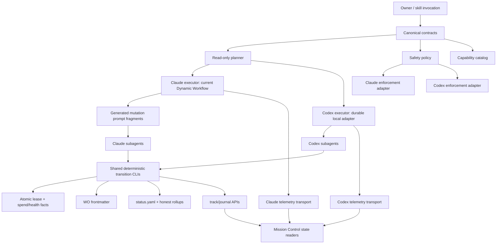

# Proposal 32 — Native dual-runtime operation without split truth

**Date:** 2026-07-10
**Status:** IMPLEMENTED THROUGH R9 · R10 FIXTURE/SOURCE GREEN · R11 CURRENT-HEAD `LIVE_SHORT` GREEN · INSTALLED R10 + `LIVE_OVERNIGHT` PENDING
**Scope:** Make Pandacorp operate safely and natively through Claude Code or OpenAI Codex in separate sessions, with exactly one runtime owning a project at a time, while preserving Claude's existing behavior, exploiting runtime-specific strengths, and enforcing one canonical source and one writer per fact. Runtime-to-runtime messaging, live collaboration, and simultaneous builds are explicitly out of scope.
**Predecessor:** [Proposal 25 — Multi-runtime portability](../25-multi-runtime-portability.md)
**Independent review handoff:** [Claude Code review handoff](claude-code-review-handoff.md)
**Independent review evidence:** [Claude Code review report](claude-code-review-report.md)

> **Scope correction (2026-07-12):** BL-0074 is P2 non-blocking hardening, not a new promotion gate.
> Claude and Codex intentionally keep separate executors. R10/R11 certify each executor's observable
> governed contract and the committed safe-point handoff; they do not require Dynamic Workflows to
> expose a nonexistent host-side filesystem/process seam or eliminate its model-agent boundary. The
> installed Claude 9.95.2 state-seam qualification is green; the full installed R10 chain and R11
> `LIVE_OVERNIGHT` remain the actual pending gates.

## Executive decision

The goal is **not** to make Claude Code and Codex use identical mechanisms. The goal is to make both runtimes honor the same product and governance contract while each uses its strongest native execution vehicle.

“Dual runtime” means **sequential interchangeability**: the owner may run lifecycle phases in either
tool in separate sessions. Governed `implement` writes from Codex remain the one temporary exception
until the installed R10 switch and R11 `LIVE_OVERNIGHT` gates pass; today those writes stay in Claude.
Pandacorp reconstructs truth from canonical files. Claude never sends work or messages to Codex,
Codex never replies to Claude, and the plan never requires both runtimes to be active together.

The non-negotiable architecture is:

1. **One canonical source per fact.** Runtime files are deterministic projections or narrow adapters, never parallel definitions.
2. **One writer per state transition.** Claude and Codex may request work, but they must not independently implement the mutation rules for work-order state, rollups, phase, leases, or recovery.
3. **Execution is strictly runtime-local.** A Claude invocation uses the Claude Dynamic Workflow, supervisor, and Claude subagents only. A Codex invocation uses the Pandacorp Codex executor and Codex subagents only. Neither runtime calls, messages, or delegates to the other.
4. **Runtime-specific strengths are intentional.** Claude keeps Dynamic Workflows. Codex gets a separate durable executor built on an officially supported programmable Codex surface. Codex has no documented equivalent of Claude's `Workflow()` DSL; the Codex SDK, App Server, and non-interactive CLI are building blocks for Pandacorp's adapter, not a second orchestration truth.
5. **Claude is preserved behind a last-known-good baseline.** The Dynamic Workflow remains Claude's orchestration decision-maker. Shared deterministic transition CLIs may be invoked only by its subagents through generated prompt fragments; a generated single-file bundle may contain pure shared functions only after R5 proves semantic equivalence.
6. **A cold runtime switch is safe-point-only.** The current runtime must finish/stop at a quiesced safe point and release ownership before a later session in the other runtime resumes. “Resume from any interruption” and live takeover are not accepted claims.
7. **Existing recurring jobs are not duplicated.** Claude remains scheduler owner for the two deployed routines: `pandacorp-memory-review` (harvest + review) and `pandacorp-review-launch`.
8. **Unattended Codex builds are a release requirement.** The Codex executor is designed as a durable, resumable, supervised process from its first implementation slice; unattended operation is not a later wrapper around a chat-dependent executor.
9. **Portability is a permanent maintenance invariant.** Every future change to a skill, agent, hook, template, instruction, manifest, or orchestration surface must preserve both runtime projections in the same change or explicitly declare a runtime-specific capability and tested fallback.

The red team **rejected** the earlier assumption that a neutral build core, a Codex Goal controller, cross-runtime locking, arbitrary-point resume, or worktree-based Codex parallelism could be treated as already-valid architecture. The independent Claude review then confirmed those rejections and identified the enforceable seam: deterministic CLIs called by subagents, generated prompt fragments, and path/key guards — not a service directly called from a Dynamic Workflow body.

## 1. Owner intent and constraints

The owner wants:

- Full use of Pandacorp from both Claude Code and Codex.
- One active runtime per project. Inter-runtime chat, live coordination, and simultaneous execution are not product requirements.
- No regression to the Claude Code workflow that created and currently operates the factory.
- One source of truth for skills, agents, instructions, state, policy, package metadata, orchestration rules, and recurring ownership.
- Codex-specific improvements when Codex has a stronger native capability.
- Claude-specific behavior to remain available when it is stronger or already owns an operation.
- Every intentional runtime difference documented with a review date and reevaluation trigger.
- Independent cross-model review before implementation.
- A manually started `implement` run from either runtime can continue safely for hours without the owner present. A local executor requires the host to remain powered and awake.

This proposal is a plan and evidence snapshot. It does **not** change the current operational standard. The current truth remains in the constitution, standards, registry, skills, engine, and runtime configuration until the owner approves and an implementation lands.

## 2. Method

The proposal combines:

- A repository-wide coupling census of Claude-specific tools, skills, agents, hooks, engines, telemetry, and Mission Control.
- Inspection of the existing Codex adapter layer.
- Current official Codex documentation for subagents, hooks, skills, plugins, Goal/long-running work, scheduled tasks, project configuration, and cloud tasks.
- Three independent adversarial reviews:
  - architecture and capability assumptions;
  - strict DR-115 single-source-of-truth compliance;
  - regression risk from the perspective of the Claude Code maintainer.
- A fresh execution of the existing Claude-side baseline suites.

### Official Codex sources used

- [Multi-agent operations](https://developers.openai.com/codex/concepts/multi-agents)
- [Hooks](https://learn.chatgpt.com/docs/hooks)
- [Skills](https://developers.openai.com/codex/skills)
- [Build plugins](https://developers.openai.com/codex/plugins/build)
- [Scheduled tasks](https://developers.openai.com/codex/app/automations)
- [Follow a goal](https://developers.openai.com/codex/use-cases/follow-goals)
- [Codex Cloud](https://developers.openai.com/codex/cloud)
- [AGENTS.md](https://developers.openai.com/codex/guides/agents-md)
- [Configuration reference](https://developers.openai.com/codex/config-reference)

## 3. Current-state inventory

### 3.1 What is already portable and healthy

| Capability | Canonical source | Claude surface | Codex surface | Status |
|---|---|---|---|---|
| Repository instructions | `AGENTS.md` | imported by `CLAUDE.md` | native | Healthy |
| Skills | `plugin/skills/*/SKILL.md` | Claude plugin | `.agents/skills` symlink + Codex plugin | Healthy |
| Named agents | `plugin/agents/*.md` | native definitions | generated TOML | Partial projection |
| Durable build state | WO frontmatter and `.pandacorp/` files | consumed by engine | readable by Codex | Healthy base |
| Cross-runtime governance | constitution, standards, registry | shared | shared | Healthy base |
| Plugin identity version | two manifests | Claude manifest | Codex manifest | Drift-checked only partially |

Verified repository facts on 2026-07-10:

- 25 skill definitions.
- `.agents/skills -> ../plugin/skills` is healthy.
- 14 canonical agent definitions.
- 17 Codex TOML files: 14 projections plus 3 generic tier workers.
- `AGENTS.md` is 17,010 bytes, below the current 32 KiB project-instruction budget.
- Claude and Codex manifests are both at plugin version `9.85.0`.
- `check-derived-drift.sh` is green.

### 3.2 Claude-native capabilities in active use

Claude owns a mature execution path:

- `pandacorp-build.js`: a 2,057-line Dynamic Workflow using injected `agent`, `parallel`, `phase`, `budget`, `args`, and `log` globals.
- Global artifact-disjoint waves across FRDs.
- A serialized **per-process** commit promise chain; it does not serialize independent processes or runtimes.
- Serial and split review gates.
- Recovery and bounded repair.
- Safe-point queue draining.
- Hardening-gated release transition.
- Workflow supervisor behavior using Claude-native monitoring, wakeups, notifications, task cancellation, and transcripts.
- Claude hooks for backup, dangerous-command blocking, write reminders, Stop verification, lesson capture, derived-drift enforcement, and subagent telemetry.
- Mission Control live events and installed-plugin status from Claude-specific paths. The legacy `tasks.ts` reader is currently inert: it has no production import site and its claimed `TASKS_DIR` config does not exist.

A second Dynamic Workflow exists:

- `pandacorp-backlog.js`: Scan → isolated implementation fan-out → serialized merge/validation → report for the factory backlog.

Any dual-runtime plan that covers only `/pandacorp:implement` is incomplete.

### 3.3 Existing Codex adapter layer

The repository already contains:

- Codex plugin manifest.
- Generated custom-agent TOMLs.
- Generic `tier-mech`, `tier-standard`, and `tier-judge` workers.
- Open-standard skill discovery through the symlink.
- An attended build playbook in `agent-portability.md`.
- A tool-translation table.
- Open follow-ups BL-0030, BL-0031, and BL-0032.

The adapter is useful but not yet a write-safe equivalent:

- There is no project `.codex/config.toml`.
- The plugin hooks have not been certified live under Codex.
- Discovering skills through the symlink does not install, enable, or trust plugin hooks.
- Internal skills can still be implicitly selected without `agents/openai.yaml` sidecars.
- Agent tool restrictions are mostly translated into prose rather than enforced capabilities.
- Model IDs are duplicated and already temporally stale.
- Codex has no certified build executor or supervisor for the Pandacorp state machine.

### 3.4 Recurring jobs: defined versus deployed

The proposal must not conflate routine definitions with installed schedules.

| Routine | Defined | Deployed now | Scheduler owner | Codex action |
|---|---:|---:|---|---|
| `pandacorp-memory-review` | Yes | Yes | Claude | Do not schedule; it already includes harvest + review |
| `pandacorp-review-launch` | Yes | Yes | Claude | Do not schedule |
| `pandacorp-consistency-sweep` | Yes | No | Unassigned until deployment | Do not infer deployment |

There is no separate installed harvest routine. Harvest is part of `pandacorp-memory-review`.

## 4. Fresh baseline evidence

The following suites were run from the factory root on 2026-07-10 and were green:

| Suite | Result |
|---|---:|
| Review-split engine harness — `test-build-engine.mjs` | 3/3 scenarios |
| Main build-engine harness — `test-pandacorp-build.mjs` | 54/54 scenarios |
| Derived-drift self-test | 10/10 |
| Dangerous-command gate | 54/54 |
| Ad-hoc write nudge | 13/13 |
| Gate-config version detector | 8/8 |
| Backup/protected-state suite | 12/12 |

These are valuable characterization and guard tests, but they are not a live runtime oracle. They stub the Dynamic Workflow environment and do not prove:

- a real installed plugin after cache update and restart;
- generated single-file bundle semantics inside a real Dynamic Workflow (direct imports, filesystem access, and direct CLI calls from a workflow body are already confirmed unsupported);
- Monitor/wakeup/cancel/resume semantics;
- real Codex hook payloads and unified shell coverage;
- exclusive ownership when two local sessions accidentally contend;
- a cold runtime switch after the first session stops at a safe point;
- unattended Goal or scheduled-task continuity;
- Mission Control deduplication across runtime transports.

The focused review-split harness also logs new unmatched labels that receive `{}` while the suite passes. This is evidence that the harness needs a coverage update before it can be treated as a complete oracle.

## 5. Correct definition of parity

Parity is evaluated at three levels.

### 5.1 Governance parity — mandatory

Both runtimes must preserve:

- Human gates.
- Hard-deny safety classes.
- Language and documentation discipline.
- One-writer state transitions.
- Independent review.
- Bounded repair and budget ceilings.
- A runtime-neutral durable spend brake for any non-Claude executor; thread/depth caps are not cumulative spend limits.
- No release before hardening.
- Protected-state rules.

### 5.2 Behavioral parity — mandatory

Given the same canonical inputs and a supported execution mode, both runtimes must preserve:

- Allowed transition traces, not only the final state.
- Dependency order.
- Write serialization and quiescence rules.
- Reviewer independence.
- Gate evidence.
- Safe-point semantics.
- Lock ownership.
- Recovery boundaries.
- Queue scoping.

Two executions that end with the same files but violated safety properties during the run are **not** equivalent.

### 5.3 Mechanism parity — explicitly not required

Allowed differences include:

- Dynamic Workflow versus a Codex executor.
- Claude monitoring versus Codex task/Goal steering.
- Runtime-specific permission systems.
- Runtime-specific UI and notifications.
- A capability being intentionally owned by only one runtime.

## 6. Single-source-of-truth model

### 6.1 State truth must be described precisely

It is incorrect to say that “status.yaml plus frontmatter” jointly own build state.

- Each WO's `implementation_status` lives only in that WO's frontmatter.
- FRD and blueprint implementation statuses are honest rollup caches derived from WOs.
- Status counts are honest caches derived at safe points.
- Project phase and facts specific to the active run live in `.pandacorp/status.yaml`.
- Liveness is derived through a single resolver crossing lease ownership and heartbeat recency.
- `track.jsonl` is durable timing evidence, not work-order state.
- Product phase, WO, and build truth derive from files. R9 closed the former achievements/XP exception: durable rewards now come only from the version-2 gamification ledger after a canonical file/git/artifact oracle corroborates the fact. Runtime events remain observability transport; replay or aliases alone cannot award durable XP.

A safe-point-only cold switch is required because the current engine also holds non-persistent process state: `frdState`, `globalQueue`, `doneIds`, `blockedIds`, `gateQueue`, `gatesInFlight`, `convergeQueue`, the per-process `commitChain`, per-FRD `gateAttempts`, `agentSpawned`, and `consecutiveBlocks`. The first runtime must settle or discard in-flight work, persist its safe point, release the lease, and end. A later runtime reconstructs scheduling from frontmatter and inherits durable reopen, health, and spend floors; it never applies an old in-flight gate verdict. Every certified executor — attended or unattended — must renew the lease at a cadence no slower than `TTL/3` while it owns the project.

### 6.2 Implemented canonical source graph

The machine-readable complete graph lives in `plugin/runtime/source-graph.json`; this table highlights
the authoring sources most relevant to dual-runtime operation.

| Fact | Canonical source | Projection/consumer |
|---|---|---|
| Shared repository rules | `AGENTS.md` | Claude import; native readers |
| Claude-only guidance | `CLAUDE.md` | Claude only |
| Skill contract | each `SKILL.md` | Claude/Codex discovery |
| Skill runtime capability/invocation metadata | `plugin/runtime/skill-runtime-policy.json` | generated `plugin/runtime/skill-capabilities.json`; internal-skill sidecars remain metadata-only |
| Shared named-agent instruction + neutral tier | `plugin/agents/*.md` | Claude reads the source directly; generated `.codex/agents/*.toml` mirrors |
| Agent tier assignment | canonical agent frontmatter | generators |
| Codex-only generic tier workers | `plugin/runtime/codex-tier-workers.json` | generated `.codex/agents/tier-*.toml` |
| Tier-to-model mapping | `plugin/runtime/model-tiers.json` | generated Codex agent artifacts; docs point to it |
| Shared plugin metadata | `plugin/runtime/plugin-metadata.json` | both manifests plus the repo-local Codex marketplace projection |
| Runtime manifest extensions | proposed namespaced manifest fragments | both generated manifests |
| Safety policy and hard-deny cases | one machine-readable policy linked to DR rules | runtime registrations and tests |
| Gate implementations | shared `plugin/scripts/*` | payload adapters call them |
| Capability status/differences | proposed `factory/runtime-capabilities.yaml` | generated rendering or direct references only |
| Routine definition and ownership | next to each canonical routine definition | installed schedule is deployment, not truth |
| Atomic WO status | WO frontmatter | planner/readers |
| Phase and active-run facts | `status.yaml` | skills/Mission Control |
| Lock ownership | atomic lease service | both runtime adapters |
| Timeline | `track.jsonl` | Mission Control |
| Live telemetry | one neutral schema and emitter | runtime transports; never state |

The names above are proposed architecture, not permission to create a central registry that repeats facts already owned elsewhere. For example, a runtime-capability catalog may own capability status, but it must not repeat a routine's schedule prompt or an agent's role instructions.

### 6.2.1 Neutral delegation vocabulary

Canonical skills, agents, and workflow contracts express **task intent**, never a vendor/model dependency:

| Canonical tier | Meaning | Claude input alias | Runtime mapping behavior |
|---|---|---|---|
| `MECH` | deterministic/mechanical, near-zero judgment | Haiku | map to the current low-cost mechanical worker |
| `STANDARD` | normal implementation/research | Sonnet | map to the current default implementation worker |
| `JUDGE` | architecture, security, adversarial review | Opus | map to the current strongest automatically selectable judge |
| `OWNER_ONLY_MAX` | exceptional maximum-cost tier | Fable or explicit maximum request | never auto-select; owner must request/approve |

The aliases are accepted **inputs**, not canonical storage. If the owner says “use Sonnet for implementation and Opus for review” while authoring from Claude Code, the authoring flow normalizes that request to `STANDARD` and `JUDGE`, writes those tiers into the shared contract, and generates both runtime projections. Codex then resolves the tiers through `model-tiers.yaml` to the best currently available GPT-5.5/GPT-5.6 Terra/Luna-class configuration; Claude resolves them to its native model names.

Rules:

- Exact model IDs/names appear only in the runtime mapping or generated projections.
- An exact runtime-only pin requested intentionally is stored in that runtime's adapter override, never in the shared skill/agent contract.
- Capability needs are expressed as constraints (`different_model_family_from: implementer`, `reasoning: high`, `read_only: true`), not brand names.
- No adapter may silently downgrade a required tier/capability. Missing equivalence is `UNSUPPORTED` with an explicit fallback or a blocking owner decision.
- Changing a mapping never requires editing every skill/agent; regenerating projections and passing conformance is the bridge.

### 6.3 One writer boundary — mediated on Claude, direct on Codex

The desired end state is:

```text
Claude Dynamic Workflow --> generated prompt fragment --> Claude subagent --+
                                                                          |
Codex attended executor -----------------------------------------------+   |
                                                                      v   v
                                                        deterministic transition CLI
                                                                      |
                                                                      +--> WO frontmatter
                                                                      +--> rollup caches
                                                                      +--> status.yaml
                                                                      +--> track/journal APIs
                                                                      +--> atomic lease/spend facts
```

Executors choose **how** to execute. The planner determines **what** is eligible. Only the relevant deterministic CLI applies each migrated governed transition. On Claude, the workflow body cannot import modules, access the filesystem, or call a CLI; its subagent invokes the CLI under a generated instruction fragment. Therefore the enforceable boundary is path/key-based, not call-graph-based:

- one canonical CLI implementation per transition slice;
- one generated prompt fragment instructing all Claude mutation agents to call it;
- a lint proving retired mutation prose no longer appears in either engine;
- hooks/CI/static guards rejecting direct writes to governed paths or keys outside the CLI;
- golden tests proving identical CLI mutations when invoked directly and through a Claude subagent.

This is an architectural target, not a claim about current code. Today essentially all governed engine mutations — including `phase: release`, rollups, reopen counts, and `last_green_sha` ordering — are embedded in agent prompts, with the rollup rule repeated in at least seven places. The current engine cannot simply be joined by another controller without creating a second writer.

## 7. Red-team verdict ledger

| Prior proposal | Verdict | Reason | Revised position |
|---|---|---|---|
| Extract a neutral core and connect both runtimes | Modify strongly | Workflow import/bundle support is unproven; engine is deeply mixed | Run a compatibility spike first; extract only after a GO decision |
| Goal mode is the Codex build controller | Kill as a settled claim | Goal does not prove DAG, writer, gate, budget, or crash semantics | Treat Goal/subagents as experimental vehicle behind live spikes |
| Existing file lock prevents concurrent runtimes | Kill | Current preflight then write is TOCTOU | Implement an atomic owner-token lease before Codex writes |
| Resume works from any runtime interruption | Kill | In-memory promises, attempts, budgets, worktrees, and run IDs exist | Permit handoff only at quiesced safe points; add recovery reconciliation |
| Codex parallel writes use worktrees by default | Kill | DR-060 explicitly chose shared tree + disjoint artifacts + one writer | Codex V1 is sequential; any parallel strategy needs its own ADR and E2E |
| Hooks can simply be shared | Modify | Schema compatibility is not complete enforcement; shell interception has gaps | One policy, runtime registration/payload adapters, defense in depth |
| Move Claude events to a neutral stream immediately | Kill | Mission Control and the engine are Claude-path coupled | Additive dual-read/adapter migration; no state derives from events |
| Add a separate ownership registry for routines | Kill | It would duplicate the canonical routine definition | Store ownership with the routine; installed tasks are deployments |
| Same final state proves parity | Kill | Temporary safety violations may disappear by the end | Assert trace invariants and evidence as well as final state |

### Red-team conclusion

The strategic direction is viable, but the earlier plan is not approved as implementation architecture. The safe architecture is **progressive capability certification**, not a big-bang shared-core extraction.

## 8. Critical blocker: atomic single-runtime lease

Current behavior has a read-then-write race:

- `preflight-implement.sh` diagnoses liveness.
- `launch-implement.sh` later writes `running: true` and touches `build.lock`.
- Two local sessions — whether from the same or different runtimes — can both pass the read before either writes.

The common lease must be acquired atomically before any build mutation. Reuse the repository's existing atomic-`mkdir` mutex precedent from the product merge queue. The lease directory is `.pandacorp/run/lease/`; `owner.json` contains:

- `run_id`.
- runtime and executor identity.
- random owner token.
- acquisition time, `heartbeat_at`, and `ttl_s`.
- compare-owner release.
- verification owner and capability version.
- compatibility projection to legacy `running`, heartbeat, and `build.lock` during migration.

Acquire uses atomic `mkdir`; writing/renewing `owner.json` uses temporary-file + atomic `mv` only after confirming the owner token. Every executor renews at `≤ TTL/3`. Stale reclaim requires both the lease heartbeat and all legacy signals to be stale, records a tombstone/journal entry, and uses its own atomic election so two reclaimers cannot win. Release compares the owner token before deleting `owner.json` and removing the empty lease directory. A non-owner release fails loud.

Special hazard: Claude's Stop gate stands aside when it sees fresh build signals. A non-certified Codex controller must not be allowed to create those signals, or it could disable verification for a later or accidentally overlapping Claude session. In lease mode, the Stop gate stands aside only for a fresh lease whose `verification_owner` and `capability_version` are certified. R2 closed the former `jq`-missing fail-open path and the source/fixture ownership corpus is green. PORT-5 now permits only the installed-canary-certified `EXPERIMENTAL/attended_foreground/targeted-only` Codex profile; the installed R10 switch and R11 `LIVE_OVERNIGHT` canaries still gate cross-runtime and unattended/overnight expansion.

## 9. Corrected target architecture



Key properties:

- Claude's executor remains the known-good default.
- R2, R3, R6, offline R7/R8, the R10 bidirectional fixture and the installed attended single-target canary are green. Codex may therefore write only through `EXPERIMENTAL/attended_foreground/targeted-only`; the installed Claude→Codex→Claude R10 canary and several-hours R11 `LIVE_OVERNIGHT` canary still gate runtime switching and unattended/overnight expansion.
- Codex unattended durability is a baseline release requirement; parallel shared-tree writes remain a separate promotion.
- Runtime locality is enforced at dispatch: the active adapter may resolve only agents and models belonging to its own runtime.
- Both runtimes are denied direct writes after a transition slice migrates; Claude reaches the CLI through a subagent, Codex may call it directly or through its agent.
- Telemetry remains secondary.
- Any temporary feature flag has an owner, expiration gate, and no duplicate mutation logic.

### 9.1 Implementation delegation contract used for this rollout

When the owner authorizes implementation, the principal Codex agent is the **architect, planner, orchestrator, integrator, and final reviewer**. It does not implement the work packages itself.

- Every implementation slice is delegated to a bounded subagent with explicit owned files, acceptance criteria, prohibited areas, and verification command.
- Tier/model is selected from the subtask, never inherited from the principal: MECH for deterministic mechanical work; STANDARD for normal implementation; JUDGE for architecture-sensitive, security, migration, and adversarial review. The concrete current model (for example an available GPT-5.5/GPT-5.6 Terra/Luna-class option) is resolved at dispatch time from the canonical runtime mapping, never hardcoded into this proposal.
- Parallel implementation is allowed only for artifact-disjoint slices. Shared manifests, version allocation, decision logs, registries, and migration hotspots have one designated writer.
- The implementing subagent cannot certify its own work. A separate reviewer subagent, preferably a different model/configuration, reruns evidence and authors adversarial checks.
- If integration or review finds a defect, the principal delegates the repair; it does not silently take over implementation.
- The principal owns the global source graph, rollout order, GO/NO-GO decisions, cross-slice consistency, final baseline, and owner communication.
- Each ring is landed through: implementer subagent → independent reviewer subagent → principal integration verdict. No ring advances on self-report.

| Ring | Implementation delegate | Independent verification delegate | Principal responsibility |
|---|---|---|---|
| R0 | STANDARD for docs/harness repair; MECH for receipts | JUDGE | approve exact supersession set and owner gates |
| R1 | STANDARD | JUDGE (SSOT/adversarial) | own canonical source graph and generation boundaries |
| R2 | JUDGE (concurrency/safety) | separate JUDGE | own lease contract and GO/NO-GO |
| R3 | STANDARD + JUDGE security specialist where needed | separate JUDGE/security reviewer | own enforcement parity and activation gate |
| R4 | STANDARD | JUDGE | own executor contract; forbid production writes |
| R5 | JUDGE spike implementer | separate JUDGE | choose GO bundle vs stable NO-GO architecture |
| R6 | STANDARD by transition slice; JUDGE for high-risk slices | separate JUDGE per slice | sequence slices and prove old writer removal |
| R7 | STANDARD | JUDGE | integrate the durable Codex path and certify traces |
| R8 | STANDARD for executor mechanics; JUDGE for merge/ownership | separate JUDGE | choose proven Codex drain-all or Claude ownership |
| R9 | STANDARD Mission Control implementer | JUDGE data/SSOT reviewer | protect event/state boundaries and vocabulary |
| R10 | MECH/STANDARD canary runners | JUDGE verdict agent | coordinate cold-switch scenarios and final certification |
| R11 | STANDARD for failure harness; JUDGE for durability/safety | separate JUDGE | certify unattended Codex operation before parity claim |

At dispatch time the principal resolves each tier to the best currently available model in the owner's Codex environment (including GPT-5.5 or GPT-5.6 Terra/Luna-class options where available). The mapping itself remains canonical machine-readable policy; this table never pins volatile model IDs.

## 10. Implementation plan with GO/NO-GO gates

The output lists below preserve the authorized rollout contract. The dated implementation-result
blocks and the consolidated status in §16 are the current verdict when a planned/future-tense line
describes work that has since landed.

### R0 — Freeze the last-known-good baseline

Outputs:

- **Owner-gated standards hotfix via `/pandacorp:learn`, before runtime work:** retract the unsafe current claims in `agent-portability.md` and `AGENTS.md`. Until R2 passes, the lock is a TTL liveness guard, not atomic mutual exclusion; switching runtimes is allowed only after a clean safe-point stop; a non-Claude runtime must not clear or take a build lock; Codex is read/review-only on projects with build state. This proposal describes the hotfix but does not apply it.
- Record factory SHA, plugin version, overlay version, installed plugin SHA, and engine hashes.
- Repair stale harness coverage by adding matchers for `baseline-precheck`, `pin:*`, `gate-worktree`, and `apply-gate:*`; add CLI-path scenarios before R6.
- Record the harness mapping explicitly: `test-build-engine.mjs` = review split (3 scenarios); `test-pandacorp-build.mjs` = main engine (54 scenarios).
- Add a bounded real Claude canary plan for a disposable sibling fixture created specifically for runtime certification; never use a real product or protected owner state.
- Define rollback without deleting `.pandacorp/` or resetting durable state.

Gate R0:

- All current suites green.
- A grep gate proves unqualified lock/resume claims are absent and the replacement text names one-runtime-at-a-time, clean safe-point stop, cold resume, and the R2 reevaluation trigger.
- Installed Claude plugin updated and restarted in a fresh session.
- In a future implementation/certification turn — not during the review — one targeted disposable-fixture Claude FRD canary proves the live workflow and supervisor, with `maxAgents`/spend ceiling fixed in advance and fixture cleanup owned explicitly.

### R1 — Source graph and deterministic projections

Outputs:

- Declare canonical sources, generators, outputs, and runtime adapters in one acyclic source graph.
- Move the 14 shared agent bodies + neutral tier/capability metadata to the canonical runtime-neutral agent source set; generate byte-equivalent Claude Markdown definitions and Codex TOMLs from it. Claude behavior must remain unchanged.
- Move generic Codex tier-worker definitions out of generator constants.
- Centralize tier mapping without changing Claude engine cost semantics.
- Add an authoring normalizer: Claude aliases (`haiku`/`sonnet`/`opus`) and Codex model names supplied by the owner resolve to neutral tiers unless an exact runtime-only override is explicitly requested.
- Generate and validate both complete manifests from shared metadata plus namespaced extensions.
- Extend drift detection to missing and orphan outputs.
- Make the model-literal lint repo-wide, explicitly including `AGENTS.md`; only the mapping source, generated outputs, and dated history are allowed to carry current model IDs.
- Cross-link BL-0040/BL-0041 (hand-copied Manual tables), BL-0044 (derived-surface edit enforcement), and BL-0062 (duplicated prose derivation).

Gate R1:

- Two clean generations are byte-identical.
- Generated tree equals committed tree.
- A fixture skill that requests STANDARD implementation + JUDGE review produces a valid Claude projection and a valid Codex projection from the same canonical input.
- A fixture request written as Sonnet + Opus normalizes to those same neutral tiers; no vendor name leaks into the canonical skill body.
- A required capability with no mapping fails closed rather than silently selecting a weaker model.
- Full manifest identity (`name`, `version`, `description`, `author`, `license`, `keywords`) derives from the common source.
- A second writer, generator cycle, orphan/missing TOML, stale model, or manual manifest edit makes the gate red through source/CI or an explicit local command — not only a later Claude Stop hook.

### R2 — Atomic lease and liveness resolver

Outputs:

- Implement atomic acquire/renew/release/reclaim.
- Add owner-token compare-and-release.
- Add a monotonic fencing epoch to every acquisition. Every governed transition CLI must validate both owner token and current epoch so a revived zombie process can never write after reclaim.
- Preserve legacy Claude signals as projections behind a feature flag.
- Make Stop-gate delegation require a certified verification owner.
- Require every certified executor to renew at `≤ TTL/3`.
- Persist spend and consecutive-block floors as durable run facts so a crash/relaunch cannot reset the safety brakes.
- Fix the `jq`-missing Stop-gate path fail-closed in the same slice.

Gate R2:

- Two simultaneous contenders produce one winner.
- Non-owner release is rejected.
- A writer holding an older fencing epoch is rejected after reclaim, even if its process later revives.
- Stale reclaim is deterministic and fail-closed.
- Killing an uncertified Codex contender never disables Claude Stop verification.
- A fresh foreign legacy signal without a certified lease does not suppress verification; `jq` absent is red.
- Claude live canary remains green with legacy mode default.

### R3 — Codex enforcement before Codex writes

Outputs:

- Install, enable, trust, and test the Codex plugin from its actual cache.
- Add project Codex config, bounded agent depth/concurrency, sandbox, permission profiles, and rules/execpolicy.
- Add skill sidecars for internal engines.
- Build runtime payload adapters over one safety policy and shared scripts.
- Either remove the Codex manifest's current `hooks` declaration until certification or generate it only when the capability catalog marks the hook adapter `PROVEN`.
- Document that only command hook handlers execute today and that hooks do not replace sandbox, permission profiles, execpolicy/rules, or Claude deny settings.
- Document the hash-based manual re-trust required after hook changes and minimize it by keeping stable registrations pointed at rarely-changing policy scripts.

Gate R3:

- Dangerous commands are denied in the app and CLI through tested paths.
- Red Stop gate fails closed.
- Invalid hook payload fails closed.
- “I have a bug” routes through `change`, not directly to `bug`.
- Claude golden hook tests remain unchanged and green.
- Rollback is concrete: disable/untrust Codex hooks, remove project Codex config additions, and verify Claude remains unchanged; canonical state is not rolled back.

If R3 cannot provide the constitution's hard-deny level, Codex remains read/review-only.

### R4 — All-skill portability certification + executor design spike (no governed build writes)

Outputs:

- Build a 25-skill capability matrix from the canonical `SKILL.md` set: invocation, inputs, outputs, human gates, runtime-specific tool translation, current status (`PROVEN`/`EXPERIMENTAL`/`FALLBACK`/`UNSUPPORTED`), fixture/smoke evidence, and reevaluation trigger.
- Certify non-build lifecycle flows from both doors using disposable fixtures or read-only/dry-run evidence as appropriate: onboarding, idea flows, spec/scaffold, design, architecture/work-orders, change/decide/iterate, upgrade/sync, release/review-launch, memory, and portfolio operations. This is sequential portability testing, never cross-runtime collaboration.
- Prove internal skills route through their public front doors under Codex and that human gates remain identical.
- Add an authoring canary: from a Claude-side request “create a skill that uses Sonnet to implement and Opus to review,” the resulting canonical skill stores `STANDARD` + `JUDGE`, generates both adapters, and passes both discovery/invocation tests.
- Exercise the smallest sequential executor shape against an in-memory or disposable simulation.
- Select the official Codex control surface with a bounded spike. The primary candidate is a server-side TypeScript executor using `@openai/codex-sdk`; App Server or `codex exec` may be selected only with better durability evidence. Goal mode and the desktop UI are control surfaces, not the durable state owner.
- Design the Codex executor as restartable from day one: canonical checkpoint recovery, heartbeat, fenced atomic lease renewal, durable spend/health ledger, structured journal, notification adapter, and safe pause on a true owner gate.
- Prove strict runtime locality: the Codex adapter can dispatch only Codex agents/models and the Claude adapter only Claude agents/models. A cross-runtime dispatch request fails closed.
- Prove agent selection, implementer/reviewer separation, bounded execution, and expected transition requests without mutating a real project.
- Design a runtime-neutral durable spend ledger checked before every dispatch; Codex `max_threads`/`max_depth` remain concurrency controls, not the cumulative brake.
- Use no shared-tree parallel writes.
- Treat every transition request as a recorded intent until R5/R6 establish the deterministic CLI + generated-prompt single-writer seam.
- Define, but do not implement, the separate `implement-backlog` runtime contract.

Gate R4:

- Every one of the 25 canonical skills has exactly one status and one tested fallback; no skill is silently omitted because it is Claude-native.
- Running the same fixture flow through Claude and Codex produces equivalent canonical artifacts/gates, even when the runtime mechanism differs.
- Simulation covers success, red gate, repair, needs-owner, targeted queue, hardening failure, VERIFIED skip, and clean-release intent.
- Trace invariants pass in the simulation.
- Corrupting the executor's in-memory count does not bypass the durable dispatch cap.
- Codex still has no permission to take the production build lease or mutate governed project state.

### R5 — Shared-core shape decision

Facts already settled by the installed Claude runtime contract:

- A Dynamic Workflow body cannot import modules, access Node/filesystem APIs, or call a CLI directly.
- A Claude-side CLI call is necessarily performed by a subagent, hence a model roundtrip.
- A reusable pure function can reach a workflow only as generated text in the deterministic single-file script.

Questions that remain to prove empirically:

- Can a canonical pure-function source be bundled deterministically into both single-file engines while preserving injected-global semantics and resume determinism?
- Can generated prompt fragments direct Claude subagents to the same shared transition CLI without semantic drift?
- Does the same CLI with the same fixture inputs produce byte-equivalent mutations when invoked directly and through a Claude subagent?
- Are injected globals, args normalization, budgets, resume, and errors preserved?
- Can current source-level harnesses and a live installed workflow exercise the seam?

Decision:

- **GO generated pure bundle:** migrate pure read/planning helpers one at a time as generated projections, while transition writes still live in shared CLIs invoked by agents.
- **NO-GO generated bundle:** keep both Claude engines canonical for orchestration indefinitely; share schemas, read-only resolvers, generated prompt fragments/contracts, and deterministic transition CLIs. This is an acceptable stable end state, not a failed port.

No shared-core extraction begins before this gate.

### R6 — Incremental transition migration

For every slice:

1. Start with an idempotent rollup + status-counts CLI, then consider `last_green_sha` stamping and archive protocol.
2. Add the deterministic CLI, canonical generated prompt fragment, and golden contract tests.
3. Change every applicable Claude prompt to consume the generated fragment behind a bounded rollout flag.
4. Run source and live Claude baselines.
5. Remove every retired mutation instruction in the same cutover; a grep/lint must report zero stale prose patterns in both engines.
6. Add path/key writer-boundary guards that reject direct governed writes outside the CLI.
7. Only then connect Codex.

Overlay compatibility is part of each slice: an older deployed engine must either remain compatible with the new CLI or be rejected by the existing gate-config/version mechanism before execution.

The old generic migration recipe is superseded by the seven steps above. In particular, “remove the replaced branch” means deleting prompt-prose writers, not only JavaScript branches.

Temporary shadow comparison may observe outputs, but it may not remain as a second active writer.

### R7 — Codex sequential durable executor with governed writes

This ring exists only after at least one complete transition slice has migrated through R6 and the replaced Claude mutation branch has been removed.

Outputs:

- Connect Codex to migrated planner/state seams one slice at a time.
- Execute one WO at a time; no shared-tree parallel writes.
- Use the common atomic lease and certified Stop-gate ownership.
- Renew the lease at `≤ TTL/3` and check the durable spend ledger before every dispatch.
- Preserve implementer/reviewer separation and the full FRD gate.
- Use the same durable journal, lease fencing, budget, recovery, and supervisor contracts in attended debugging and unattended operation; the conversational thread is never the durable state owner.
- Leave every non-migrated transition owned exclusively by the Claude executor; Codex must stop or hand off rather than reimplement it.

Gate R7:

- A disposable fixture covers success, red gate, repair, needs-owner, targeted queue, hardening failure, VERIFIED skip, and clean release.
- Trace invariants pass.
- Static and runtime checks prove no governed-state writes outside the authorized writer for migrated transitions.
- Claude's replaced mutation branch is absent, not retained as a fallback.
- A live overspend canary attempts `N+k` dispatches against cap `N`; the durable ledger stops at `N` even if executor memory lies.

### R8 — `implement-backlog` decision and Codex-native capability promotions

`pandacorp-backlog` is a separate engine and receives an independent decision, not accidental inheritance from the product-build executor.

Required outcome:

- Preserve Codex manual single-item backlog implementation.
- Cross-link BL-0025: shared monotonic values in drain-all require one allocator/merge owner.
- Spike a Codex drain-all executor against a throwaway backlog repository: Scan → tier-sized isolated implementation → serialized merge → validator between merges → report → resume from item frontmatter.
- If the E2E proves worktree ownership, merge serialization, validator rollback, and resume, mark Codex drain-all `PROVEN`.
- If it fails, record Claude as the explicit owner of drain-all, keep Codex single-item mode supported, and add a capability reevaluation trigger. Do not maintain a second partial drain-all implementation.

Run independent spikes for:

- skill-triggered subagent launch;
- bounded concurrency and steering;
- reviewer isolation;
- interruption/resume at a safe point;
- Goal mode continuity;
- app sleep/restart/network failure;
- notification behavior;
- scheduled follow-up only for a new Codex-owned use case.

Each capability is labeled `PROVEN`, `EXPERIMENTAL`, `FALLBACK`, or `UNSUPPORTED` in the capability catalog.

Codex parallel writes require a new ADR because they may conflict with DR-060. Worktrees are not the default. A parallel executor must prove artifact ownership, a single commit/apply writer, quiet-tree gate semantics, integration verification, and budget accounting.

Implementation evidence (2026-07-11): the product-build ready change-queue slice is green offline.
The fenced controller distinguishes bare, targeted-change and targeted-FRD runs; validates complete
FRD/WO DAG plans; journals and recovers every apply/archive boundary; binds integration evidence to
HEAD plus exact paths/content and the completed apply-transaction digest; limits progress-field
normalization to leading YAML frontmatter; and rejects symlink roots/cards/parents/targets, swapped
FRD status files, transaction tampering and archive collisions.
Targeted runs have a strict terminal authority boundary: after their scoped FRDs verify they persist
`complete`, quiesce and keep `phase: implementation`; they never enter project-wide hardening or
release merely because their target happened to be the final global pending FRD. Only a bare run may
perform global hardening and advance release. The Claude Dynamic Workflow enforces the same split.
`test-build-state.mjs` passes 21/21—including post-`archive-card` delete/mutation/foreign-target
recovery—and `test-codex-executor.mjs` passes its full corpus. This closes the
`R8-ready-change-drain` blocker only. The independent factory-backlog spike passes 26/26 but records an
explicit NO-GO for a second Codex drain-all controller: Claude remains its owner and Codex keeps the
canonical single-item recipe until the reevaluation gates in `plugin/runtime/codex/R8-BACKLOG-SPIKE.md`
pass. The backlog rollback uses `git reset --keep` and aborts without overwriting a concurrent owner
edit; its corpus passes 26/26. R7 live-model and R11 unattended evidence remain separate gates.

### R9 — Additive Mission Control adaptation

Outputs:

- Keep the Claude event path operational during migration.
- Add `runtime`, `run_id`, and `event_id` to new events.
- Define one semantic vocabulary per event act; runtime transports map to it instead of emitting parallel names for the same act.
- Add a Codex transport and a Mission Control adapter/dual-reader.
- Deduplicate the live feed by stable IDs and semantic aliases, but never treat declared identities as accounting proof. Durable achievement/XP facts enter the existing schema-v2 gamification ledger only through a file/git/artifact oracle and a canonical fact key; uncorroborated telemetry cannot unlock or attribute results.
- Continue deriving phase/WO/build state from WOs/status/track. Document that achievements/XP are the current event-derived exception until this ring closes it.
- Make plugin status and runtime commands adapter-aware, including FRD-15's separate Claude-installed-cache and Codex-installed-cache verdicts.
- Preserve La Fragua's vocabulary through the same canonical event contract; do not invent a runtime-specific visual vocabulary.
- Treat `tasks.ts` as dead code unless separately rewired; it is not a live Claude dependency.
- Cross-link BL-0040/BL-0041 so capability/event tables are generated or referenced, never hand-copied.

Gate R9:

- Legacy Claude sessions still render.
- Duplicate and vocabulary-variant replay changes neither project state nor achievements/XP.
- Mutating or deleting the live event stream cannot change phase/WO/build truth; after ledger reconciliation it also cannot inflate durable achievements.

**Implementation result (2026-07-11): GATE GREEN.** The v2 ledger migrates v1 maxima without
inventing history, uses one atomic fail-closed writer, materializes facts from canonical oracles, and
feeds every production XP/achievement consumer through an explicit durable boundary. Delete, mutate,
forge, alias, cross-transport replay, corruption and concurrent reconciliation tests are green.
Signals with no durable oracle remain telemetry-only and are documented as honestly locked.

### R10 — Sequential runtime-switch certification

**Implementation result (2026-07-11): FIXTURE PROVEN · LIVE PENDING.**
`plugin/scripts/test-runtime-switch.mjs` proves the bidirectional cold handoff against a disposable
Git project and the real fenced state APIs; companion suites cover the remaining failure corpus.
The fixture carries one logical build `run_id` across both runtime changes and proves cumulative
spend/health floors survive in both directions. Both launchers consume one resolver that identifies a
released cross-runtime implementation safe point and reuses the ID automatically; the owner never
copies it. Same-runtime passes, release state or explicit `new` intent denote a new run.
The installed Claude Dynamic Workflow → Codex app → Claude app canary cannot be launched from this
Codex session and remains a mandatory live gate. Canonical evidence and exact commands:
`plugin/runtime/codex/R10-CERTIFICATION.md`. This result does not promote Codex `implement`.

Required live scenarios:

- Claude reaches a safe point, releases the lease, and ends; a later Codex session reconstructs state and resumes.
- Codex reaches a safe point, releases the lease, and ends; a later Claude session reconstructs state and resumes.
- No runtime-to-runtime messages, live steering, shared transcript, or simultaneous work are used in either scenario.
- Simultaneous lease acquisition.
- Non-owner release.
- Stale lease recovery.
- Crashed/uncertified Codex lease never suppresses Claude Stop verification; `jq`-absent fails closed.
- Crash with `IN_PROGRESS` WO reconciliation.
- Orphan gate worktree/journal recovery.
- Budget and health-breaker persistence.
- Gate rejection and preserved adversarial tests.
- No release without hardening.
- Plugin source/cache/overlay drift.
- No duplicate routine schedules.
- `implement-backlog` Codex drain-all full contract if promoted; otherwise verification that only Claude owns drain-all and Codex exposes no competing scheduler/controller.

### R11 — Mandatory unattended Codex certification

R11 is a release gate for claiming `implement` parity. It certifies a manually launched Codex build; it does not copy the two Claude-owned recurring routines.

Because unattended and multi-FRD execution remain outside the promoted `EXPERIMENTAL`
`attended_foreground` profile, this gate runs only through the R11 one-shot certification permit. The
normal launcher rejects an empty authorization for that broader scope. The permit is bound to one
standalone disposable fixture, current HEAD/UUID, plugin/overlay plus executor/supervisor/launcher
hashes, an exact multi-FRD scope, foreground mode and exact limits; it is consumed before the lease
and revoked on every terminal path. It is separate from and backward-compatible with R10, and grants
no normal-project write permission.

- Test a representative multi-FRD run for several hours without owner interaction.
- Test controller/app restart, unexpected sleep, network loss, rate limits, expired authentication, approval denial, token/budget exhaustion, supervisor restart, and a true owner decision.
- Preflight host, credentials, network, sandbox, and narrowly preauthorized routine commands. Prevent system sleep for the run; a powered-off or sleeping local machine cannot continue.
- Prove supervisor independence, heartbeat at `≤ TTL/3`, fenced lease, bounded backoff/circuit breaker, durable dispatch IDs, uncertain-dispatch reconciliation, safe-point checkpointing, and notifications for stall, owner gate, budget stop, failure, and completion.
- A true owner gate drains/cancels children, persists `needs_owner`, releases the lease only after quiescence, and notifies the owner.
- Kill and restart at each durable boundary; prove no rebuild of `VERIFIED`, no stale review verdict, no zombie write, no duplicate dispatch, and no reset of spend/reopen/health brakes.
- Run one targeted low-budget canary and one bounded overnight canary. Afterwards, certify cold continuation in Claude; also certify the inverse direction.

Failure blocks the claim that Codex `implement` has full parity. It does not regress Claude or block Codex read/review and certified non-build skills.
- Prove the same durable spend brake used by R7; unattended execution never trusts only in-memory counts.

Failure or continued deferral leaves Claude as the supported unattended/global build writer. Codex
retains only its separately certified attended single-target profile; the certification exception does
not widen that normal-project permission.

**Implementation evidence (2026-07-11):** `OFFLINE_ACCELERATED` is green through
`plugin/scripts/test-codex-unattended.mjs`; it covers preflight failures, supervisor crash/restart and
breaker behavior, process/lease quiescence, `TTL/3` renewal, durable uncertain dispatches, network,
rate-limit, auth and approval failures, receipt paths with spaces, whole-supervisor sleep prevention
and fail-closed evidence parsing. `LIVE_SHORT` is also green: real provider run
`codex-20260711T183105Z-28552` completed on current head in 114 seconds with two dispatches/four durable
spend units, controller verification, a 120000 ms heartbeat within `TTL/3`, terminal supervisor
evidence and fenced release; its disposable fixture was removed. `LIVE_OVERNIGHT` is still **PENDING**;
a short or accelerated run cannot satisfy the representative several-hours gate. Canonical evidence
and the resumable command are in `plugin/runtime/codex/R11-CERTIFICATION.md`. Consequently R11 and
overall parity remain NO-GO/FALLBACK: the provider/current-head short path is green, while installed
R10 switching and the overnight R11 gate remain open.

## 11. Anti-drift and anti-duplication test plan

### Source-graph gate

Verify:

- one source per fact ID;
- one producer per output;
- no output is also a source;
- no cycles;
- no source inside a generated directory;
- no missing or undeclared outputs.

Canaries: second writer, generator cycle, generated file declared canonical, duplicate output.

### Deterministic-generation gate

Generate twice in clean temporary roots and require:

- byte-identical runs;
- committed outputs equal generated outputs;
- exact output set;
- provenance headers;
- independence from cwd, locale, time, and environment noise.

### Complete manifest projection

Compare name, version, description, author, license, keywords, and runtime extensions — not only version.

### Agent projection

Require:

- exact canonical-agent set;
- exact declared runtime-only worker set;
- no orphan TOMLs;
- canonical body preserved;
- tier/model/effort sourced only from their owners;
- explicit translation of tool restrictions.

### Model-literal lint

Current model IDs may appear only in the model-mapping source, generated outputs, or dated history. The lint is repo-wide and explicitly covers `AGENTS.md`; operative prose names tiers or points to the generated mapping.

### Hook conformance corpus

Run the same cases through Claude and Codex payload adapters. Dangerous commands, invalid payloads, Stop failures, `jq` absence, fresh foreign heartbeats, and protected writes must produce equivalent fail-closed policy decisions. A manifest capability may be declared only when the catalog marks it `PROVEN`.

### State-writer boundary

Static and runtime path/key checks reject direct changes to governed status keys, WO state, reopen counts, rollups, or journals outside the authorized CLI. Generated Claude prompt fragments are the sole instruction producer; lint rejects every retired mutation sentence in engine sources.

### Atomic-lease race

Barrier-start both adapters and assert one atomic-`mkdir` winner, no loser writes, token-matched renewal/release, safe reclaim election, `≤ TTL/3` renewal, and release on all terminal paths.

### Cache-not-truth

Changing counts or FRD rollups without changing WOs must not affect planning or phase/WO/build UI truth. Duplicate and vocabulary-variant events must not inflate achievements/XP after R9. Corrupt atomic sources fail loud.

### Durable spend brake

Attempt `N+k` dispatches against cap `N`, corrupt the executor's in-memory counter, and prove the durable append-only run ledger still stops at `N`. Repeat in attended and unattended fixtures.

### Runtime ownership

A Claude-owned routine must not produce a Codex automation. A second owner for the same routine ID is red.

## 12. Rollout and rollback

### Rings

1. Unit and source harnesses.
2. Source plugin validation.
3. Installed plugin cache + restart.
4. Disposable overlay fixture.
5. Real idle project, read-only/review.
6. One targeted FRD with low agent cap.
7. Cold runtime switch after a clean safe-point stop and lease release.
8. Bounded overnight canary.

Every ring has GO/NO-GO evidence.

Codex hook rollback includes de-trust/disable plus removal of Codex project config, without reverting canonical state. Every hook-definition hash change carries a visible manual re-trust step. Drift checks must also run from a non-Claude enforcement point; relying only on a future Claude Stop hook leaves Codex-authored drift latent.

### Rollback principles

- Never reset or recreate `.pandacorp/`.
- Preserve green commits and verified WOs.
- Roll back code through a forward-compatible revert or patch plus version bump/update/restart.
- Preserve compatibility readers for durable state.
- Roll back a runtime adapter without rolling back canonical state.
- Record last-known-good SHA, plugin version, overlay version, installed plugin SHA, engine hash, and capability version.

## 13. Documentation model

Canonical ownership after the implemented rings:

- `factory/standards/agent-portability.md` owns the normative portability contract.
- Machine-readable capability/model/source registries own volatile facts.
- Mission Control Manual renders or points to those sources.
- `CLAUDE.md` contains only Claude-specific operation.
- Skill sidecars contain only Codex-specific invocation metadata.
- Decision logs record history and rationale.
- This proposal becomes a dated evidence artifact and points to the canonical sources.
- Claude's review report records findings and deltas; it must not copy this proposal as another plan.

Every capability entry should include:

- contract;
- support status (`PROVEN`, `EXPERIMENTAL`, `FALLBACK`, `UNSUPPORTED`);
- runtime owner where exclusive;
- verification evidence and date;
- fallback;
- reevaluation trigger.

### 13.1 Permanent dual-runtime change protocol

After Proposal 32 lands, portability becomes part of the definition of done for **every** factory change, regardless of whether the change is requested from Claude Code or Codex.

| Changed surface | Mandatory same-change work |
|---|---|
| Skill | Keep one `SKILL.md` contract with neutral tiers/capabilities; regenerate/validate runtime metadata; smoke invocation/routing in both tools |
| Agent | Edit the neutral agent source; regenerate Claude Markdown + Codex TOML; verify prompt, tier, tools/sandbox, and no orphan output |
| Model/tier policy | Edit only `model-tiers.yaml`; regenerate all projections and documentation; run model-literal lint |
| Hook/safety rule | Edit one policy/corpus; generate or adapt both registrations; run Claude and Codex payload conformance; retain defense in depth |
| Plugin metadata/version | Edit canonical metadata; generate both manifests; validate full-field equality + runtime extensions |
| Template/overlay | Update the canonical template once; verify Claude and Codex project surfaces; bump overlay and test upgrade compatibility |
| Orchestration/state transition | Edit the one canonical CLI/schema/fragment source; regenerate adapters; prove old writer removal and both executor contracts |
| Mission Control/runtime capability | Update the machine-readable capability/event source; render/pointer docs; test both runtime transports without deriving state from telemetry |

Close-out gate:

1. `check-source-graph` proves one source and one producer per output.
2. Deterministic regeneration produces no diff and no orphan/missing outputs.
3. Claude conformance remains green.
4. Codex conformance remains green or the capability is explicitly marked runtime-specific with a tested fallback.
5. The change's decision log names any intentional runtime difference and its reevaluation trigger.

A factory change that passes only in the runtime where it was authored is incomplete. The runtime adapter is allowed to differ; the shared contract, governance, and evidence may not silently degrade.

## 14. Backlog reconciliation

No backlog status changes are part of this proposal reconciliation.

- **BL-0030 remains open and expands into R2/R3:** live Codex hook certification, payload adapters, lease-aware Stop ownership, renewal cadence, and fail-closed `jq` behavior.
- **BL-0031 remains open and is absorbed by R3:** project Codex config, sandbox/permission profiles, rules/execpolicy, and bounded agent concurrency.
- **BL-0032 remains open and is absorbed by R3:** `agents/openai.yaml` sidecars for internal skills without duplicating their `SKILL.md` contracts.
- **Adjacent items to cross-link:** BL-0025 in R8; BL-0040/BL-0041 in R1/R9; BL-0044 in R1; BL-0062 in R1/R6.
- **Implementation-time backlog candidates, not filed here:** `verify-before-stop.sh` `jq` fail-open; current unsafe PORT-5/AGENTS lock+resume claims; full manifest/orphan-output drift coverage; tier mapping extraction; event vocabulary + achievement ledger; premature Codex manifest hooks claim; inert `tasks.ts`; unmatched harness labels.

## 15. Owner decisions — approved 2026-07-11

All five architecture decisions are resolved. Hook re-trust remains an activation action, not an architecture choice.

1. **R0 hotfix approved.** Until R2, Codex is read/review-only on projects with build state and switching tools requires a clean safe-point stop.
2. **Constitution clarification approved.** Claude Dynamic Workflows remain Claude-specific orchestration; shared deterministic CLIs/contracts do not replace that executor.
3. **Strict runtime locality approved.** Claude runs only Claude agents/models; Codex runs only Codex agents/models. Cross-runtime messaging and delegation are out of scope.
4. **Unattended Codex `implement` approved as mandatory.** It is designed into the durable executor and certified by R11. The two existing recurring routines remain Claude-owned and are not duplicated.
5. **Enforcement activation approved.** Codex hook/config trust and failure-injection canaries remain required activation gates.

Resolved defaults, requiring no additional owner decision:

- If generated pure-function bundling is NO-GO, Claude remains canonical for orchestration while both runtimes share CLIs/contracts; Codex keeps its separately certified sequential executor.
- Claude continues to own the two deployed recurring routines. Codex unattended support applies to owner-launched builds, not duplicated schedules.
- Codex hook definitions are kept stable and narrow to minimize hash re-trust. Any required re-trust is presented as a human activation gate when that ring lands.

## 16. Implementation and certification status

The owner authorized implementation on 2026-07-11. The rollout now stands as follows:

- R0–R9 are implemented and their source/offline gates are green.
- R10 is green at source/fixture level, including bidirectional cold continuation with one logical run identity. The installed attended single-target canary is also green (`codex-20260715T151508Z-99530`, final HEAD `9c2ea16c5b82a7df71b3eb793e0bd4c57554399b`); broader installed bidirectional scope remains pending.
- R11 `OFFLINE_ACCELERATED` and the current-head real-provider `LIVE_SHORT` are green; `LIVE_OVERNIGHT` remains pending because no short or accelerated run can substitute for the several-hours gate.
- Claude Code operation, its Dynamic Workflow controller, supervisor and the two deployed recurring routines remain unchanged and Claude-owned.
- Codex `implement` is `EXPERIMENTAL` only for exactly one FRD or one ready change, attended in the foreground, cumulative `<=7200`, zero automatic restarts and ending in `implementation`. Bare/global/background/unattended/hardening/release/cross-runtime forms remain `FALLBACK`/denied until their own gates pass.

## 17. Recommended verdict

**The attended single-target Codex build profile is certified and available as `EXPERIMENTAL`; full native build-write parity is not yet certified. Keep every broader form denied until its installed R10/R11 gate is green.**

The implemented architecture preserves one source of truth, strict runtime-local dispatch, an atomic
fenced lease, durable spend/health facts, generated transition prompts, a separate sequential Codex
executor and adapter-aware Mission Control observability. The remaining work is certification, not a
second implementation architecture: prove the broader installed cold switch and a representative
unattended run before widening the permission claim.

## 18. Claude review disposition appendix

The independent review remains the dated source for its own evidence and wording. This appendix records how every finding and claim correction changed the canonical proposal. No finding was rejected.

### 18.1 Finding dispositions

| Finding | Disposition | Proposal change | Verified repository evidence |
|---|---|---|---|
| P0-1 — Dynamic Workflow cannot directly call a shared service | **ACCEPTED** | §6.3/§9 now use subagent-invoked transition CLIs, generated prompt fragments, and path/key enforcement; R5 is re-scoped to bundle semantics and subagent-CLI equivalence | Engine has no direct filesystem writes; governed mutations are prompt prose; installed workflow contract has no Node/filesystem/import surface |
| P0-2 — unsafe lock/resume claims remain current | **ACCEPTED** | R0 begins with an owner-gated standards hotfix and interim Codex read/review-only rule | `agent-portability.md:73-80` and `AGENTS.md:97` assert unqualified resume and cross-runtime lock safety; launch acquisition is read-then-write |
| P1-1 — Stop suppression + `jq` fail-open + premature hooks claim | **ACCEPTED** | R2 certifies lease ownership and closes `jq` fail-open; R3 gates/removes Codex manifest hooks claim until proven | `verify-before-stop.sh:14-23,30-56`; `plugin/.codex-plugin/plugin.json:6` |
| P1-2 — no portable cumulative spend brake | **ACCEPTED** | Durable spend ledger added to R4/R7/R11 and test plan | Claude external brake is transcript-based; `max_threads`/`max_depth` do not cap cumulative dispatch |
| P1-3 — handoff loses in-memory scheduler/brake state | **ACCEPTED** | §6.1 inventories lost state; R2 requires `≤ TTL/3` renewal and durable spend/health floors; R10 adds crash-owner cases | `frdState`, queues, gate promises, `commitChain`, attempts, `agentSpawned`, and `consecutiveBlocks` are process-local |
| P1-4 — achievements/XP currently derive from raw events | **ACCEPTED** | §6.1 labels the exception; R9 adds semantic vocabulary and achievement ledger/dedup | `signals.ts` folds raw events; `gamification.ts:574-584` counts every `test_ok`; Event schema has no runtime/run/event IDs |
| P1-5 — no mechanism removes prompt-prose writers | **ACCEPTED** | R6 now requires canonical generated fragments, zero-occurrence prose lint, deterministic CLIs, and path/key guards | Rollup/status mutation prose repeats across engine prompt templates |
| P2-1 — editorial ring defects | **ACCEPTED** | R9 gate label fixed, R8 duplicate removed, harness name↔file mapping added | Direct inspection of the prior proposal |
| P2-2 — Goal citation and automation limits | **ACCEPTED** | Official Goal source added; R11 states desktop-running/machine-awake/local-folder constraints; R3 records command-hook-only behavior | Official OpenAI Goal, Scheduled Tasks, and Hooks documentation rechecked 2026-07-10 |
| P2-3 — manifest fields and enforcement point under-guarded | **ACCEPTED** | R1 adds full-field projection, orphan/missing canaries, and non-Claude enforcement point | `check-derived-drift.sh:54-59` compares only versions; agent diff catches outputs but self-test lacks orphan/missing canaries |
| P2-4 — tier mapping triplicated | **ACCEPTED** | R1 centralizes mappings and makes repo-wide model-literal lint include `AGENTS.md` | Generator constants, PORT-2 table, and `AGENTS.md:89` all restate mappings |
| P2-5 — recurring trust cost and no Codex rollback | **ACCEPTED** | R3 documents hash re-trust, stable registration strategy, and explicit disable/untrust rollback | Official Codex hook trust is definition-hash based |
| P3-1 — Mission Control `tasks.ts` is inert | **ACCEPTED** | §3.2 and R9 no longer treat it as a live dependency | `readTasksState` has no production import; claimed `TASKS_DIR` config is absent |
| P3-2 — adjacent backlog links missing | **ACCEPTED** | R1/R6/R8/R9 and §14 cross-link BL-0025, BL-0040, BL-0041, BL-0044, and BL-0062 | All five items are open and match the cited defect classes |

### 18.2 Claim-correction dispositions

| Reviewed claim | Disposition | Reconciled wording/location |
|---|---|---|
| §3.2 engine capability list | **ACCEPTED** | Commit serialization is now explicitly per-process, not cross-runtime (§3.2) |
| §6.3 prompt-embedded mutations | **ACCEPTED** | Now says essentially all governed mutations live in prompts and names the generated-fragment/CLI boundary (§6.3) |
| §6.1 events never reconstruct state | **ACCEPTED** | Split into file-derived phase/WO/build truth plus the current achievements/XP exception (§6.1, R9) |
| §8 lock race and Stop hazard | **ACCEPTED** | Retained and expanded with lease certification, owner tokens, renewal, and `jq` fail-closed (§8, R2) |
| §3.1 manifest drift is partial | **ACCEPTED** | R1 specifies full-field generation and notes the current Stop-only enforcement gap |
| §3.3 model IDs are duplicated/stale | **ACCEPTED** | R1 and the model-literal test name all three current copies, including `AGENTS.md` |
| §3.4 routine table | **ACCEPTED** | Kept: memory-review and review-launch deployed under Claude; no separate harvest; consistency-sweep defined but not deployed |
| §4 baseline table | **ACCEPTED** | Harness filenames are now mapped to 3/3 and 54/54; unmatched labels are explicit R0 work |
| §2 official source list | **ACCEPTED** | Goal citation corrected; scheduled-task and hook limitations moved into R3/R11 |
| §5/§9 sequential Codex and no direct writes | **ACCEPTED** | Added durable spend, lease renewal, generated prompt fragments, and subagent mediation (§5, §6.3, R4/R6/R7) |
| Handoff baseline counts | **ACCEPTED** | Counts remain unchanged and reverified |
| §14 imports/bundling unknown | **ACCEPTED** | Direct imports/Node/CLI are settled NO; only generated-bundle semantics and subagent-CLI equivalence remain for R5 |
