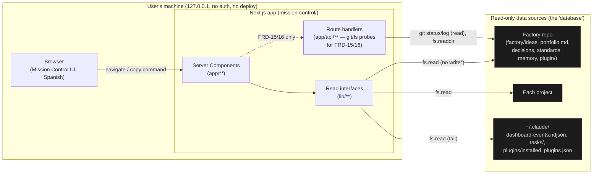

# Platform architecture — Pandacorp Mission Control

> **Source-of-truth hierarchy:** `FRD > FDD > design-tokens > blueprint > work order`.
> This document is the **platform architecture** (DR-049): the one stable, project-wide
> technical foundation. It describes the chosen stack, the high-level architecture, the
> "data model" (the factory filesystem MC reads), the read interfaces, cross-cutting
> concerns, the testing strategy and the explicit no-deploy posture. It does **not**
> describe how each feature is implemented — that lives per-FRD in
> `docs/frds/frd-NN-<slug>/blueprint.md`, which references this file rather than restating it.

---

## 1. What Mission Control is (and the one rule that shapes everything)

Mission Control is a **local, read-only dashboard** to operate the Pandacorp factory: see the
state of ideas and projects, read their documentation, know the next command to copy, and watch
the "party" of agents build live — wrapped in honest RPG gamification.

The single golden rule that drives every architectural choice: **Mission Control NEVER calls
Claude and NEVER executes anything.** It only *reads files* from the factory repo and the user's
Claude install, and renders text + a "next command" to copy. The one allowed write is rewriting a
card's `status: discarded` frontmatter (FRD-02) — a human decision, not a build step.

Consequences that ripple through the whole architecture:
- No AI SDK, no API key, no subprocess that runs Claude, no "thinking" spinners.
- The factory repo **is the database** (read-only) — no DB, no ORM, no migrations.
- Local only: listens on `127.0.0.1`, no auth, no deploy, no multi-tenant concerns.

---

## 2. Chosen stack (golden path A, trimmed) — approved by the owner

Golden path **A (Next.js)** from `factory/standards/stack.md`, deliberately **trimmed** for an
internal read-only tool. The full justification and the discarded alternatives are recorded in
**[ADR-0001](../adr/ADR-0001-stack.md)**; the summary:

| Layer | Choice | Version (Jun 2026) | Why (trimmed rationale) |
|---|---|---|---|
| Framework | **Next.js** (App Router) | `^16.2.7` | Server Components read the filesystem on the server; zero client data-fetching plumbing. |
| Language | **TypeScript** `strict` + `noUncheckedIndexedAccess` | `^5.9.3` | Factory durable convention (no `any`, no `@ts-ignore`). Pinned <6.0 — see ADR-0001. |
| UI runtime | **React** | `^19.2.7` | Bundled with Next 16. |
| Styling | **Tailwind CSS v4** (CSS-first `@theme`) | `^4.1.13` | OKLCH tokens (FRD-13) map cleanly onto v4's `@theme`. No `tailwind.config.js`. |
| Lint + format | **Biome** | `^2.4.16` | One fast tool; replaces ESLint+Prettier. `pnpm biome check .` is gate #1. |
| Tests | **Vitest** + `@testing-library/react` + `jsdom` | vitest `^4.1.9` | TDD in `lib/`; component tests for the UI. |
| Frontmatter | **gray-matter** | `^4.0.3` | Parses idea-card frontmatter (FRD-01/02). |
| YAML | **yaml** | `^2.8.1` | Parses `.pandacorp/status.yaml` and `factory/decisions/registry.yaml`. |
| Markdown | **react-markdown** | `^10.1.0` | Renders docs (PRD/FRD/work orders/Manual). |
| Graph layout (future) | **Dagre** | — | FRD-12 DAG; cheap (~39KB), NOT ELK.js. Added in the FRD-12 work orders, not now. |

**Package manager:** `pnpm`. **Node:** ≥20.9 (Next 16 minimum).

### Deliberately EXCLUDED from the trim (and why)
- **No database / Prisma / Drizzle** — the factory repo is the read-only data source.
- **No auth** — single local operator on `127.0.0.1`.
- **No Docker / no t3-app generator** — an internal local tool; `create-next-app` (or the
  hand-assembled equivalent) is enough.
- **No Claude SDK / no subprocess execution** — the golden rule (§1).
- **No Playwright / e2e** in v1 — optional later for critical flows; the gate is biome+tsc+vitest.
- **No payments / storage / email / analytics external services** — nothing leaves the machine.
  (`factory/standards/external-services.md` does not apply: MC touches no external service and
  no personal data beyond what already lives in the local factory repo.)

---

## 3. High-level architecture



\* The single exception write: FRD-02 discard rewrites one idea card's `status:` frontmatter.

**Rendering model.** **Server Components** are the default and do all filesystem reads through
`lib/**`. Client Components (`"use client"`) are added only where interaction demands it: the
**Copy** button (clipboard), the **discard** action (a Server Action), the Party RPG engine
(`requestAnimationFrame` animation), auto-refresh, the `visto_hasta` digest marker
(`localStorage`), and theme toggle. Everything that can be a Server Component is one.

**Why filesystem reads belong on the server.** Reading `factory/` and `~/.claude/` is privileged
local I/O — it must never be exposed to the client. Server Components (and a thin set of route
handlers for the git probes of FRD-15/16) keep all `fs`/`git` access server-side; the browser only
ever receives already-shaped, serializable data.

**Refresh.** v1 re-reads on navigation and via a lightweight poll/refresh (FRD-01/12). Robust
file-watching is explicitly Backlog (PRD). Event tails are **capped** (100–200, FRD-06/12) so long
builds don't degrade the render.

---

## 4. Data model — the factory filesystem (the read-only "database")

There is no schema in a DB; the schema is the **shape of the files MC reads**. This section is the
complete, non-TBD inventory. Path constants live in `lib/config.ts` (override root with
`PANDACORP_FACTORY_ROOT`; default = one level up from `process.cwd()`, because MC lives inside the
factory repo).

### 4.1 Idea cards — `factory/ideas/*.md` (skip `_idea-template.md`, `decision-log.md`)
Markdown with YAML frontmatter (parsed by `gray-matter`). Fields read (FRD-01/02):

| Field | Type | Notes |
|---|---|---|
| `title` | string | Card title. |
| `status` | enum | `discovered \| recommended \| in-pipeline \| shipped \| discarded`. The ONLY field MC ever writes (→ `discarded`, FRD-02). Once `in-pipeline` the card freezes as a pointer. |
| `project_type` | enum | `web \| mobile \| desktop \| ai \| claude-code \| prompt-system \| automation \| cli \| rework \| …` (category chip + board filter). |
| `return_type` | enum | `monetary \| opportunity \| personal \| mixed` (return chip). |
| `score` | number | Priority score. |
| (body) | markdown | Summary + key points, rendered in the card detail. |

### 4.2 Owner profile — `factory/profile.md`
Its **absence** triggers the onboarding gate (FRD-01); when present, fields (name, goals,
interests, assets, `projects_path`) personalize views and bound the FRD-16 orphan scan.

### 4.3 Portfolio — `factory/portfolio.md`
A table of created projects → each row yields a **project path** and optional `repo:` URL
(FRD-03 recovery command). For each path, MC reads that project's state and docs.

### 4.4 Per-project state — `<projectPath>/.pandacorp/status.yaml`
Machine state (English), parsed by `yaml`. Fields read (FRD-01/02/03/04/14):
`project`, `phase` (`product \| design \| architecture \| implementation \| release \| operation`),
`version`, `running`, `progress`, `work_orders_total`, `work_orders_done`, `pending_decisions`,
`pending_bugs`, `rethink_pending`, `advance_pending`, `last_green_sha`, `safe_to_test`,
`overlay_version`, `created_with`, `updated_at`. Absent/malformed → render partial, never break
(FRD-01 edge case); for an `in-pipeline` card with no status → fall back to the **documented**
column (FRD-02). `phase` is the **single source of truth** for the board column of in-pipeline
cards (the card `status` is just a pointer).

### 4.5 Per-project docs (feature-centric, DR-049) — `<projectPath>/docs/` and `.pandacorp/`
Read for the workspace, work-orders and documentation views (FRD-04/05/08):
- Product layer: `docs/product/prd.md` (+ feature-landscape table), `docs/product/architecture.md`.
- Per-feature module: `docs/frds/frd-NN-<slug>/{frd.md, fdd.md?, blueprint.md?, mocks/?, work-orders/?}`.
- Global: `docs/adr/`, `docs/analytics/`, `docs/decision-log.md`.
- Owner-facing layer (Spanish, gitignored): `.pandacorp/comms/progress.md`, `.pandacorp/inbox/decisions.md`, `.pandacorp/inbox/bugs/`.

### 4.6 Factory configuration & memory (read-only) — for Configuration / Manual / Proposals
- `factory/decisions/registry.yaml` (decision rules + `requiere_humano`) — FRD-07.
- `factory/standards/*.md` (standards by domain, severity, enforcement) — FRD-07.
- `factory/memory/*.md` (lessons: `status: candidate|active`, `promotion: none|proposed|approved|rejected`, sources) — FRD-17.
- `plugin/skills/<slug>/SKILL.md` + `plugin/agents/*.md` frontmatter (name + description) — FRD-08 **derived** Reference (never hand-copied) and FRD-07 skill/agent detail.

### 4.7 User Claude install — `~/.claude/`
- `dashboard-events.ndjson` — the **event stream** (Party FRD-06, observability FRD-12, dashboard digest FRD-18). Read as a **tail**, capped. Schema in §5.
- `tasks/<team>/` — task state for Party (tolerate absence = "no active team").
- `plugins/installed_plugins.json` — `gitCommitSha` of `pandacorp@panda-corp` for the FRD-15 drift check (compare against `git log -1 --format=%H -- plugin/`; NEVER compare the semver `version`).

### 4.8 Client-local UI state (NOT a factory/project write)
- `visto_hasta` digest marker (FRD-18) and theme/mode preference → `localStorage`. Survives
  refresh and tab close; advances only on acknowledge/act. Explicitly consistent with the
  read-only constraint (FRD-01).

---

## 5. Party / observability event contract (vendor-neutral, OpenTelemetry-style)

The producer (factory hooks → `~/.claude/dashboard-events.ndjson`) and the consumer (Mission
Control) share a **portable** NDJSON schema (FRD-12). One JSON object per line. MC only consumes
it; the emitter (`emit-event.sh` + the `SubagentStop` hook) is owned by the factory plugin.

**Minimum fields per event (FRD-12):**

| Field | Type | Meaning |
|---|---|---|
| `event` | enum | One of the bounded vocabulary (~12): `read`, `write`, `edit`, `test_ok`, `test_fail`, `message`, `start`, `end`, `handoff`, `blocked`, `review`, `achievement`. |
| `at` | ISO 8601 string | Event timestamp (drives Live / No-signal + age-in-stage). |
| `agent` / `session` | string | The subagent role (researcher, backend-dev, frontend-dev, test-writer, reviewer, …) and/or session id. |
| `tool` | string | Tool used (extra icon in the feed). |
| `status` | enum | `ok \| fail` (failure is a first-class state, FRD-06). |
| `work_order` / `task` | string | The WO/task id the event belongs to. |
| **`project`** | string | **NEW field** — the project slug the event belongs to, so the Party can tell concurrent builds apart. **Events without a `project` field are treated as legacy/global** (CLAUDE.md). The producer must be namespaced by project (plugin follow-up noted in the decision log); MC reads it defensively (optional). |

State mapping (PARTY.md §4) — events → visual states: `start`→`work`, `handoff(from,to)`→`walk`,
`end`(nothing pending)→`idle`, `blocked`→`blocked`, reviewer receives deliverable→`review`,
work-order close→`achievement`. The visual queue is **decoupled** from real state (temporal
fidelity is secondary to legibility) — MC does not need perfectly real-time events.

---

## 6. Read interfaces (`lib/**`) — the data layer boundary

All filesystem/parse access is isolated in `lib/` (factory convention: components never touch the
fs directly). Each module is a set of **pure-ish reader functions** (path in → typed data out),
unit-tested with fixtures. The foundation ships `lib/config.ts` (+ test); the rest are stubbed by
their owning FRD's work orders.

| Module | Responsibility | Owning FRD(s) |
|---|---|---|
| `lib/config.ts` ✅ | Path constants + `resolveFactoryRoot` (env override / cwd `..`). | FRD-01 |
| `lib/ideas.ts` | Read & parse idea cards (gray-matter). | FRD-01, FRD-02 |
| `lib/profile.ts` | Read profile; signal absence (onboarding gate). | FRD-01 |
| `lib/portfolio.ts` | Parse the portfolio table; tolerate broken paths. | FRD-01, FRD-03 |
| `lib/status.ts` | Read & validate `.pandacorp/status.yaml` (partial-tolerant). | FRD-01, FRD-04 |
| `lib/board.ts` | Derive each card's **column** from the two axes (status + phase). | FRD-02 |
| `lib/next-step.ts` | Pure map: status/phase → next command + folder to open. | FRD-02, FRD-03, FRD-04 |
| `lib/docs.ts` | Discover & read per-project docs (feature-centric tree). | FRD-04, FRD-05, FRD-08 |
| `lib/work-orders.ts` | Read per-FRD work orders; aggregate progress. | FRD-05 |
| `lib/events.ts` | Tail & parse `dashboard-events.ndjson` (capped); diffs. | FRD-06, FRD-12, FRD-18 |
| `lib/tasks.ts` | Read `~/.claude/tasks/` task state. | FRD-06 |
| `lib/plugin-sync.ts` | Installed SHA vs `git log -1 -- plugin/` + dirty check. | FRD-15 |
| `lib/orphans.ts` | Bounded scan of the projects folder for unadopted repos. | FRD-16 |
| `lib/registry.ts` | Parse `decisions/registry.yaml`. | FRD-07 |
| `lib/standards.ts` | Read `factory/standards/` (domain/severity/enforcement). | FRD-07 |
| `lib/memory.ts` | Read `factory/memory/` lessons + promotion state. | FRD-17 |
| `lib/reference.ts` | Derive skills/agents Reference from `plugin/` frontmatter. | FRD-07, FRD-08 |
| `lib/fs-utils.ts` | `pathExists` + small read-only fs probes (shared). | FRD-01, FRD-03 |
| `lib/snapshot.ts` | Pure derivations: `buildSnapshot`, `isSnapshotStale`. | FRD-14 |
| `lib/manual.ts` | Index of the hand-authored Manual content (Diátaxis). | FRD-08 |
| `lib/gamification.ts` | Pure XP / level / celebration engine over events+status. | FRD-09 |
| `lib/achievements.ts` | Pure stats / chains / uniques / secrets derivation. | FRD-10 |
| `lib/self-suggest.ts` | Compose local self-suggestions (bottlenecks, nudges). | FRD-17 |
| `lib/discard.ts` (write) | The single write: rewrite `status: discarded`, preserve body. | FRD-02 |

> Modules below `lib/reference.ts` were added during the work-order phase (the per-FRD blueprints surfaced them); they are pure derivations/composition over the readers above and add no new fs access.

The single mutation (`lib/discard.ts`) is the only module allowed to write, and it writes exactly
one frontmatter field of one idea card; everything else is read-only.

---

## 7. Cross-cutting concerns

- **Read-only invariant.** Enforced by isolating all writes to `lib/discard.ts`; everything else
  is `fs.read*`. No Claude/AI client dependency exists in `package.json` (auditable). The git
  probes (FRD-15/16) use read-only commands (`git status --porcelain`, `git log -1`).
- **Security / data minimization.** No auth (local single operator on `127.0.0.1`). No secrets in
  code (SOPS+age does not apply — MC has no external services and no `.env` of its own beyond the
  optional `PANDACORP_FACTORY_ROOT` override). MC reads personal/owner data that already lives in
  the local repo (`profile.md`, gitignored comms) but never transmits it anywhere — there is no
  network egress. `.claude/settings.json` already denies `rm -rf`, force-push and `.env` reads.
- **Rate limiting** is N/A: no public endpoints, no network exposure.
- **i18n / language.** UI copy and `aria-label`s in **Spanish** (the committed exception, DR-009);
  code identifiers in English. User-facing strings via i18n, never hardcoded ad hoc.
- **Accessibility & visual system (FRD-13).** OKLCH tokens (few tokens, rationed accent),
  `tabular-nums` on all numbers, 3 elevation levels, motion only `transform`/`opacity` <300ms,
  `prefers-reduced-motion` disables Party animation, no state by color alone, contrast ≥4.5:1.
  Lands with the design phase (`docs/design/design-tokens.json` + `DESIGN.md`) — the foundation
  only sets `color-scheme` + `tabular-nums` in `app/globals.css`.
- **Error/empty/loading states.** Every reader tolerates missing/malformed inputs and the UI
  renders graceful empty states (fresh factory, no projects, no events) — never a blank or a crash
  (FRD-01/03/18 edge cases).

---

## 8. Service boundaries / module structure

```
mission-control/
  app/                      # App Router: Server Components by default; route handlers for FRD-15/16
    layout.tsx, page.tsx, globals.css
    (dashboard, board, portfolio, achievements, configuration, manual, projects/[slug] …)  ← per-FRD
  lib/                      # the read interfaces (§6) — the ONLY place that touches the fs/git
    config.ts (+ .test.ts)
  components/               # shared UI (CopyButton, banners, kanban primitives) — added per-FRD
  docs/                     # product + per-FRD docs (this file lives here)
  prototype/                # APPROVED design reference (HTML). Reference only — not built upon, never deleted.
  .pandacorp/               # factory integration overlay (verify.sh, status.yaml, guide, comms…)
```

No microservices, no separate API server: Next.js is the whole app. Route handlers exist only for
the few reads that need Node APIs outside a Server Component render (git probes for drift/orphan
detection).

---

## 9. Testing strategy

- **TDD in `lib/`** (factory MUST): every reader and pure function gets acceptance-criteria tests
  with fixtures, written RED → GREEN → refactor. `lib/config.test.ts` ships with this foundation as
  the first test and the pattern to follow.
- **Component tests** with `@testing-library/react` + `jsdom` for interactive pieces (CopyButton,
  discard flow, banners) — colocated `*.test.tsx`.
- **Fixtures**, not the live factory, for `lib/` tests (deterministic; use `PANDACORP_FACTORY_ROOT`
  to point a reader at a fixture tree).
- **Gate** (`.pandacorp/verify.sh`, DR-019, fail-closed): `pnpm biome check .` → `pnpm tsc
  --noEmit` → `pnpm vitest run`. Nothing is "done" with any gate red.
- **e2e (Playwright)** is out of scope for v1 (optional later on critical flows only).

---

## 10. Deploy strategy — explicitly NONE (local only)

Mission Control is **not deployed**. It runs locally with `pnpm dev` (or `pnpm build && pnpm
start`) bound to **`127.0.0.1:3000`**. No hosting, no Vercel, no Docker, no CI/CD pipeline, no
production gate, no domain, no TLS. `/pandacorp:release` for this project means "run it locally"
(CLAUDE.md). `$0/month` by construction. The economic arc (demand-gate, unit-economics, landing,
GTM, telemetry) does **not** apply (`return_type: personal`, internal tool).

---

## 11. FRD → platform mapping (where each feature lands)

Coarse map only; the per-FRD `blueprint.md` (next phase) details components (`CMP-NN-*`),
interfaces (`IF-NN-*`) and the `REQ-NN-MMM` traceability. Every FRD is satisfiable on this
platform — no FRD is flagged as unbuildable.

| FRD | Feature | Primary `lib/` modules | Primary `app/` surface |
|---|---|---|---|
| FRD-01 | Data reading layer | `config`, `ideas`, `profile`, `portfolio`, `status`, `events` | (cross-cutting; onboarding gate) |
| FRD-02 | Ideas board | `ideas`, `board`, `next-step`, `discard` (write) | `app/board` + card detail |
| FRD-03 | Portfolio & navigation | `portfolio`, `status`, `next-step` | `app/portfolio` (rail + workspace) |
| FRD-04 | Project workspace | `status`, `docs`, `work-orders`, `next-step` | `app/projects/[slug]` (tabs) |
| FRD-05 | Work orders (live) | `work-orders`, `docs` | workspace → Work orders tab |
| FRD-06 | Party (RPG map) | `events`, `tasks` | workspace → Party tab (client engine) |
| FRD-07 | Configuration | `registry`, `standards`, `reference` | `app/configuration` |
| FRD-08 | Documentation (Manual) | `reference`, `standards`, `registry`, `docs` | `app/manual` (Diátaxis) |
| FRD-09 | Gamification (RPG theme) | `events`, `status` (derive XP from outcomes) | top bar + cross-cutting |
| FRD-10 | Achievements Hall | `events`, `status` | `app/achievements` |
| FRD-11 | Build modes | `status` (remember per project) | workspace → Commands tab |
| FRD-12 | Observability / data-viz | `events` (+ Dagre future) | header KPIs + RPG↔timeline/DAG |
| FRD-13 | Visual system & a11y | — (tokens) | `app/globals.css` + `docs/design/` (design phase) |
| FRD-14 | Snapshot & feedback | `status` (last_green_sha, chips) | workspace + portfolio rail |
| FRD-15 | Plugin out-of-sync warning | `plugin-sync` | dashboard banner + route handler |
| FRD-16 | Orphan project detection | `orphans`, `profile`, `portfolio` | dashboard banner + route handler |
| FRD-17 | Proposals inbox | `memory`, `events`, `status` | `app/proposals` + badges |
| FRD-18 | Dashboard ("Inicio") | composes `events`, `status`, `portfolio`, `memory` | `app/` (default landing) |

---

## 12. Verification checklist (this foundation)

- [x] Every FRD's requirements map to concrete `lib/` modules + `app/` surfaces (§11); none flagged unbuildable.
- [x] The data model (§4) is complete — no "TBD"; every file MC reads has its shape and source documented.
- [x] `.pandacorp/verify.sh` exists with fail-closed gates and actionable messages (DR-019).
- [x] The stack is approved by the owner and recorded in **ADR-0001** (DR-002).
- [x] The Party event contract (§5) includes the new `project` field.
