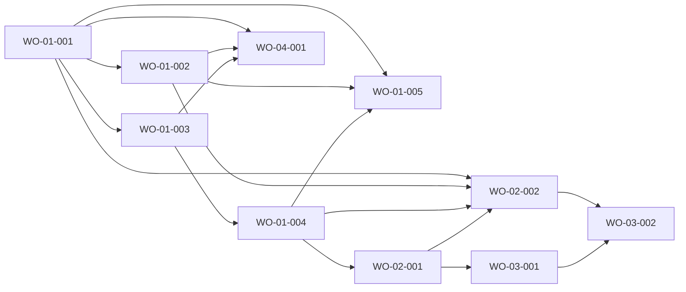

# Blueprint (bench-medium frd-01-projects, Build Plan section verbatim)

## Build Plan

The whole product plan: ten work orders, six waves. This table is the cross-FRD DAG; blueprints 02, 03 and 04 reference it and list only their own rows again.

| WO | FRD | Depends on | Artifacts (globs) | Foundation | Parallel with |
|---|---|---|---|---|---|
| WO-01-001 | 01 | none | `next.config.ts`, `messages/es.json`, `src/i18n/request.ts`, `src/app/layout.tsx`, `src/app/globals.css`, `src/app/error.tsx`, `src/app/global-error.tsx`, `src/app/not-found.tsx`, `src/app/page.tsx`, `src/lib/cn.ts`, `src/lib/routes.ts`, `src/lib/validationMessages.ts`, `src/components/core/SkipLink.tsx`, `src/components/modules/AppShell.tsx`, `src/lib/_tests/cn.test.ts`, `src/lib/_tests/routes.test.ts`, `src/lib/_tests/validationMessages.test.ts`, `src/components/core/_tests/SkipLink.test.tsx`, `src/components/modules/_tests/AppShell.test.tsx`, `src/i18n/_tests/messages.test.ts`, `docs/design/components.md` | true | none |
| WO-01-002 | 01 | WO-01-001 | `src/components/core/{Button,Field,TextInput,TextArea,SelectInput,FormAlert,Dialog,Badge,EmptyState,PageTitle}.tsx`, `src/components/modules/{ConfirmDialog,Pagination}.tsx`, `src/lib/client/**`, `src/test/setup.ts`, `src/components/core/_tests/{Button,Field,TextInput,TextArea,SelectInput,FormAlert,Dialog,Badge,EmptyState,PageTitle}.test.tsx`, `src/components/modules/_tests/{ConfirmDialog,Pagination}.test.tsx`, `src/lib/client/_tests/**`, `docs/design/components.md` | true | WO-01-003 |
| WO-01-003 | 01 | WO-01-001 | `prisma/schema.prisma`, `prisma/migrations/**`, `prisma.config.ts`, `scripts/dbReset.mjs`, `src/instrumentation.ts`, `package.json`, `pnpm-lock.yaml`, `.env`, `.env.example`, `README.md`, `src/lib/prisma.ts`, `src/server/db.ts`, `src/lib/problem.ts`, `src/lib/dates.ts`, `src/lib/pagination.ts`, `src/lib/types.ts`, `src/lib/constants.ts`, `src/lib/api/**`, `src/lib/schemas/pagination.ts`, `src/test/db.ts`, `src/test/requests.ts`, `e2e/_db.ts`, `src/_tests/instrumentation.test.ts`, `src/lib/_tests/{problem,dates,pagination,constants,types}.test.ts`, `src/lib/api/_tests/**`, `src/lib/schemas/_tests/pagination.test.ts`, `src/server/_tests/**`, `e2e/db-reset.spec.ts` | true | WO-01-002 |
| WO-01-004 | 01 | WO-01-003 | `src/server/queries/project.ts`, `src/server/queries/_tests/project.test.ts`, `src/lib/schemas/project.ts`, `src/lib/schemas/_tests/project.test.ts`, `src/app/api/v1/projects/route.ts`, `src/app/api/v1/projects/[id]/route.ts`, `src/app/api/v1/projects/_tests/**`, `e2e/projects-api.spec.ts`, `docs/api/wo-01-004.md` | false | WO-04-001 |
| WO-01-005 | 01 | WO-01-001, WO-01-002, WO-01-004 | `src/app/projects/page.tsx`, `src/app/projects/_components/**`, `e2e/projects.spec.ts`, `e2e/hydration-privacy.spec.ts` | false | WO-02-001 |
| WO-02-001 | 02 | WO-01-004 | `src/server/queries/task.ts`, `src/server/queries/_tests/task.test.ts`, `src/lib/schemas/task.ts`, `src/lib/schemas/_tests/task.test.ts`, `src/app/api/v1/projects/[id]/tasks/route.ts`, `src/app/api/v1/projects/[id]/tasks/_tests/**`, `src/app/api/v1/tasks/[taskId]/route.ts`, `src/app/api/v1/tasks/[taskId]/_tests/**`, `e2e/tasks-api.spec.ts`, `docs/api/wo-02-001.md` | false | WO-01-005 |
| WO-02-002 | 02 | WO-01-001, WO-01-002, WO-01-004, WO-02-001 | `src/app/projects/[id]/page.tsx`, `src/app/projects/[id]/not-found.tsx`, `src/app/projects/[id]/_components/**` (task create form, list and item with status select, edit dialog, delete dialog), `e2e/tasks.spec.ts` | false | WO-03-001 |
| WO-03-001 | 03 | WO-02-001 | `src/lib/taskFilters.ts`, `src/lib/_tests/taskFilters.test.ts`, `src/lib/schemas/taskQuery.ts`, `src/lib/schemas/_tests/taskQuery.test.ts`, `src/server/queries/task.ts` (modifies the list function), `src/app/api/v1/projects/[id]/tasks/route.ts` (modifies the GET), `src/server/queries/_tests/taskList.test.ts`, `src/app/api/v1/projects/[id]/tasks/_tests/list.test.ts`, `e2e/task-search-api.spec.ts`, `docs/api/wo-03-001.md` | false | WO-02-002 |
| WO-03-002 | 03 | WO-02-002, WO-03-001 | `src/app/projects/[id]/_components/TaskFilters/**` (filter form and URL building, plus the count/summary component with a unique file name), `src/app/projects/[id]/page.tsx` (modifies), `e2e/task-filters.spec.ts` | false | none |
| WO-04-001 | 04 | WO-01-001, WO-01-002, WO-01-003 | `src/server/queries/stats.ts`, `src/server/queries/_tests/stats.test.ts`, `src/app/api/v1/stats/route.ts`, `src/app/api/v1/stats/_tests/**`, `src/app/page.tsx`, `src/app/_components/**`, `e2e/dashboard.spec.ts`, `docs/api/wo-04-001.md` | false | WO-01-004 |

- **Waves (descriptive; the `dependsOn` graph is the truth):** W1 = WO-01-001; W2 = WO-01-002 + WO-01-003 (foundation, disjoint); W3 = WO-01-004 + WO-04-001; W4 = WO-01-005 + WO-02-001; W5 = WO-02-002 + WO-03-001; W6 = WO-03-002. The foundation is WO-01-001 to WO-01-003 (W1 and W2); every feature WO depends on it directly or transitively.
- **Disjointness:** wave-parallel WOs share no file: the pairs (WO-01-002, WO-01-003), (WO-01-004, WO-04-001), (WO-01-005, WO-02-001) and (WO-02-002, WO-03-001) are disjoint by their declared artifacts. Intentional overlaps, all serialized by `dependsOn`: `docs/design/components.md` (WO-01-001 then WO-01-002); `src/app/page.tsx` (WO-01-001 then WO-04-001); `src/server/queries/task.ts` and `src/app/api/v1/projects/[id]/tasks/route.ts` (WO-02-001 then WO-03-001); `src/app/projects/[id]/page.tsx` (WO-02-002 then WO-03-002); glob-level overlaps `src/app/api/v1/projects/[id]/tasks/_tests/**` (WO-02-001) with `src/app/api/v1/projects/[id]/tasks/_tests/list.test.ts` (WO-03-001), and `src/app/projects/[id]/_components/**` (WO-02-002) with `src/app/projects/[id]/_components/TaskFilters/**` (WO-03-002). Shared directories are split by file: `src/lib/_tests/` (WO-01-001 cn/routes/validationMessages, WO-01-003 problem/dates/pagination/constants/types, WO-03-001 taskFilters), `src/components/core/_tests/` (WO-01-001 SkipLink, WO-01-002 the rest), `src/components/modules/_tests/` (WO-01-001 AppShell, WO-01-002 ConfirmDialog/Pagination), `src/server/queries/_tests/` (one file per WO), `src/lib/schemas/` and its `_tests/` (one file per WO). `src/server/_tests/**` (WO-01-003) does not include `src/server/queries/_tests/`.
- **Declared dependency of WO-01-003 on WO-01-001:** WO-01-003 reads the catalog helper (`src/lib/validationMessages.ts` and `messages/es.json`, created by WO-01-001) from `problem.ts` and `schemas/pagination.ts`, so `dependsOn` lists `WO-01-001`.
- **No other hidden coupling:** WO-01-002 does not import from WO-01-003 artifacts (they run concurrently in W2): `apiRequest` receives paths from its caller and parses the problem body with its own boundary type; `useFormSubmission` receives `validate`. WO-04-001 does not use WO-01-004/WO-02-001 endpoints (its tests write rows directly).
- **Integration order:** catalog, tokens, shell (WO-01-001); then primitives and client helpers (WO-01-002) beside persistence plus API conventions (WO-01-003); then the projects API (WO-01-004) beside the dashboard (WO-04-001); then the projects page (WO-01-005) beside the tasks API (WO-02-001); then the project page and the task query extension (WO-02-002, WO-03-001); finally the filters UI (WO-03-002).
- **API contract owners:** `docs/api/wo-01-004.md` (WO-01-004; consumed by WO-01-005 and WO-02-001), `docs/api/wo-02-001.md` (WO-02-001; consumed by WO-02-002, WO-03-001), `docs/api/wo-03-001.md` (WO-03-001; consumed by WO-03-002), `docs/api/wo-04-001.md` (WO-04-001; no consumer WO). Each is written by its owner before or with the handler, before any consumer WO starts.
- **Cross-FRD dependencies:** WO-02-001 depends on WO-01-004 (it uses `getProjectById` and completes the cascade check AC-01-021.4); WO-02-002 depends on WO-01-001, WO-01-002, WO-01-004; WO-04-001 depends on WO-01-001 to WO-01-003. FRD-01 is first in the cross-FRD order.
- **Visual spec pointers:** WO-01-001 (shell, tokens) reproduces the shell and page frame of every mock, e.g. `docs/frds/frd-01-projects/mocks/projects.html`; WO-01-002 reproduces the field, button, dialog and pagination styling of `mocks/projects-errors.html`, `mocks/projects-rename-dialog.html`, `mocks/projects-delete-dialog.html`, `mocks/projects.html`; WO-01-005 reproduces all five FRD-01 mocks with `fdd.md`. FRD-02/03/04 pointers are in their blueprints. **Assets:** none (no images, icons or remote fonts; the system font stack is the `font-sans` token).
- **Dependency versions:** everything is installed at exact versions; only WO-01-003 adds a package (`pnpm add -E better-sqlite3@12.11.1`, the version the adapter already resolves; no `@types/better-sqlite3`, so TypeScript never imports it). No other WO adds a package.
- **Gate notes:** knip runs over the whole project at every per-FRD gate and flags unused exports (types and constants included; a test import counts as a consumer), so every export is imported by a test of its OWNING WO (Risks) and a symbol with no named consumer is not exported at all; the gates run per FRD at intermediate waves (FRD-04 after wave 3, FRD-01 after wave 4, FRD-02 after wave 5, FRD-03 after wave 6). `@prisma/client` is kept used by the `PrismaClientKnownRequestError` value import of the queries. The verbatim API error gate needs `problem` referenced in any route file that returns a 4xx (the builders are called from the handler file, so the name appears). Surfaces in `e2e/routes.ts` are blessed by the FRD gates, not by these WOs.

## Next
