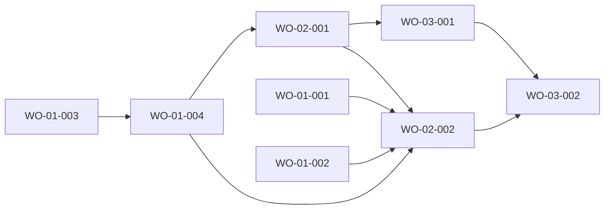

# Blueprint (bench-medium frd-02-tasks, Build Plan section verbatim)

## Build Plan

| WO | Depends on | Artifacts (globs) | Foundation | Parallel with |
|---|---|---|---|---|
| WO-02-001 | WO-01-004 | `src/server/queries/task.ts`, `src/server/queries/_tests/task.test.ts`, `src/lib/schemas/task.ts`, `src/lib/schemas/_tests/task.test.ts`, `src/app/api/v1/projects/[id]/tasks/route.ts`, `src/app/api/v1/projects/[id]/tasks/_tests/**`, `src/app/api/v1/tasks/[taskId]/route.ts`, `src/app/api/v1/tasks/[taskId]/_tests/**`, `e2e/tasks-api.spec.ts`, `docs/api/wo-02-001.md` | false | WO-01-005 (wave 4) |
| WO-02-002 | WO-01-001, WO-01-002, WO-01-004, WO-02-001 | `src/app/projects/[id]/page.tsx`, `src/app/projects/[id]/not-found.tsx`, `src/app/projects/[id]/_components/**`, `e2e/tasks.spec.ts` | false | WO-03-001 (wave 5) |

- **Order & parallelism:** WO-02-001 runs in wave 4 (after WO-01-004, which itself needs WO-01-003) beside WO-01-005; artifacts are disjoint (`src/server/queries/task.ts` vs `project.ts`; task routes vs project routes and pages). WO-02-002 runs in wave 5 beside WO-03-001: disjoint (pages and `_components/` vs `src/server/queries/task.ts`, the GET handler, `src/lib/taskFilters.ts`, `src/lib/schemas/taskQuery.ts`).
- **Intentional overlaps, serialized by `dependsOn`:** WO-03-001 MODIFIES `src/server/queries/task.ts` and `src/app/api/v1/projects/[id]/tasks/route.ts` created by WO-02-001 (`WO-03-001 dependsOn WO-02-001`). WO-03-002 MODIFIES `src/app/projects/[id]/page.tsx` created by WO-02-002 and adds the folder `src/app/projects/[id]/_components/TaskFilters/**` (inside WO-02-002's `_components/**` glob), which holds all four of its components, including the count at `src/app/projects/[id]/_components/TaskFilters/TaskResultCount.tsx` (`WO-03-002 dependsOn WO-02-002`). WO-02-002 must not create anything under `TaskFilters/**` (the reserved path).
- **Integration order:** WO-02-001 writes `docs/api/wo-02-001.md` FIRST (before its handlers), then queries, schemas, handlers. WO-02-002 reads that contract and consumes `listTasks`, `countTasksOfProject`, the schemas and the endpoints; WO-03-001 then widens the list; WO-03-002 fills the slots last.
- **Cross-FRD dependencies:** WO-02-001 depends on WO-01-004 (`getProjectById`, and the end-to-end cascade AC-01-021.4 it owns); WO-02-002 depends on the foundation WO-01-001, WO-01-002 and on WO-01-004 (project lookup for the heading). FRD-02 sits between FRD-01 and FRD-03 in the cross-FRD order.
- **API contract owners:** WO-02-001 owns `docs/api/wo-02-001.md` (the five endpoints: input / success / errors / invariants, exactly as Contracts above). WO-03-001 owns `docs/api/wo-03-001.md` for the list query parameters. WO-02-002 only consumes.
- **Cross-FRD AC ownership (from BP-01):** AC-01-021.4 is owned by WO-02-001 (the cascade is observable only through `GET /api/v1/tasks/{taskId}`); AC-01-013.1 and AC-01-013.2 are owned by WO-02-002 (the first UI that shows a task status). Every other FRD-01 AC stays with WO-01-001 to WO-01-005; both WOs comply with REQ-01-001 to REQ-01-015 and restate the relevant ones as "Shared contract" bullets.
- **Visual spec:** WO-02-002 reproduces `docs/frds/frd-02-tasks/mocks/project-tasks.html`, `project-tasks-errors.html`, `project-no-tasks.html`, `task-edit-dialog.html`, `task-delete-dialog.html`, `project-not-found.html` (screenshots in `mocks/screenshots/`) with `fdd.md`, on `docs/design/design-tokens.json`. The filter form, count and pagination drawn in those mocks are WO-03-002's. No external assets: no images, icons or remote fonts (system font stack).
- **Gate notes:** knip runs over the WHOLE project at every per-FRD gate and flags an exported symbol or type with no importer (a test that imports a symbol counts as a consumer); the FRD-01 gate runs after wave 4, i.e. after WO-02-001 but before WO-02-002, so every export is imported by a test of its OWNING WO (WO-02-001's tests import `countTasksOfProject`, every other export of `task.ts` and both schemas of `src/lib/schemas/task.ts`; WO-02-002's tests import every export of its components), never left waiting for a later consumer; these WOs export nothing without a named consumer (`TaskListOptions` and the row mapper stay module-local). The verbatim API error gate requires each route file with a 4xx to reference `problem`. Surfaces in `e2e/routes.ts` are added and blessed by the FRD gate, not by these WOs.

## Next
